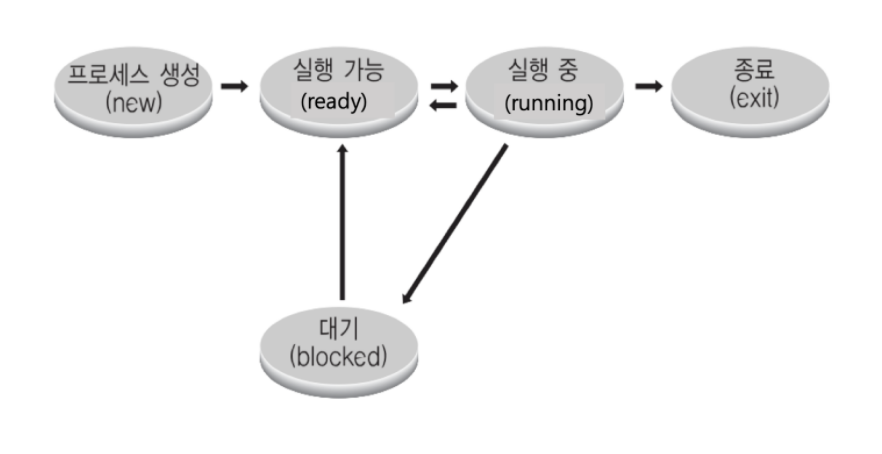

## 문제들

### 2. 운영 체제에 대한 일반적인 설명

- 하드웨어 시스템 자원을 관리하는 관리자
- 응용 프로그램이 필요로하는 시스템 자원을 제공하는 소프트웨어

### 3. 운영체제가 하드웨어 시스템 자원을 관리해야 하는 이유

- 응용 프로그램이 Storage에 있는 데이터를 함부로 삭제하거나, 수정할 수 있기 때문
- 응용 프로그램이 함부로 컴퓨터 자체를 다운시키지 못하도록 하기 위함
- 특정 응용 프로그램이 하드웨어 자원을 독점해서 사용하는 것을 막기 위함

### 4. 운영체제 기능
- 여러 응용 프로그램 중 특정 시간에 어떤 응용 프로그램을 실행시킬지를 관리한다.
- 한번에 여러 응용 프로그램을 실행시킬 수 있도록 한다.
- 응용 프로그램을 사용하는 사용자를 관리한다.

### 5. CPU Protection Rings 에 대한 설명
- 인텔 CPU 에서 CPU Protection Rings은 Level(Ring) 0, Level(Ring) 1, Level(Ring) 2, Level(Ring) 3 이 있다.
- 통상적으로 Level(Ring) 3 을 사용자 모드, Level(Ring) 0을 커널 모드로 사용한다.
- 커널 모드에서는 특권 명령어를 실행하는데 사용한다.

### 6. 시스템 콜에 대한 설명
- 프로그래밍 언어별로 시스템 콜 기반, 라이브러리를 제공하는 것이 일반적.
- 운영체제는 다양한 시스템 콜을 제공한다
- 응용 프로그램이 운영체제에 시스템 자원을 요청할 때 사용한다.

### 7. 응용 프로그램, 라이브러리, 시스템 콜에 대한 설명
- 응용 프로그램은 라이브러리를 사용하고, 라이브러리는 시스템 자원이 필요할 경우, 내부적으로 시스템 콜을 호출할 수 있다
- 운영체제는 시스템 콜을 제공한다.

### 8. 쉘(Shell) 에 대한 설명으로 가장 알맞은 것은?
- 사용자가 운영체제 기능과 서비스를 조작할 수 있도록 인터페이스를 제공하는 프로그램

### 9. 프로세스에 대한 설명으로 가장 알맞은 것은?
- 메모리에 올려저서, 실행중인 프로그램을 의미함

### 10. General Purpose OS 에 대한 설명으로 가장 알맞은 것은?
- 프로세스 실행시간에 민감하지 않고, 일반적인 목적으로 사용되는 운영체제

### 11. 프로세스 스케쥴링에 대한 설명
- 시분할 시스템: 다중 사용자 지원을 위해, 컴퓨터 응답시간을 최소화하는 시스템
- 멀티 태스킹: 단일 CPU에서 여러 응용 프로그램이 동시에 실행하는 것처럼 보이는 시스템
- 멀티 프로그래밍: 최대한 CPU를 일정 시간당 많이 활용하는 시스템

- 멀티 프로세싱: 여러 CPU에서 하나의 응용 프로그램을 병렬적으로 실행해서 실행 속도 높임.

### 12. 운영체제 스케쥴러와 관련된 설명
- 스케쥴러에서 실행되는 프로세스는 일반적으로 프로세스 상태 정보를 가지고 있다.
- 응용 프로그램은 여러 프로세스로 구성 가능, 스케쥴링의 단위는 여러가지이다.
- 대표적인 프로세스 상태 정보로는 running, ready, block 등을 들 수 있다.
- 스케쥴러는 멀티 프로세싱을 지원하기 위한 핵심 운영체제 기술이다.

### 13. 프로세스 상태에 대한 설명


- 실행(running) 상태는 프로세스가 CPU에서 실행 중인 상태를 의미한다.
- 준비(ready) 상태는 프로세스가 CPU에서 실행이 가능한 상태를 의미한다.
- 블록(block) 상태는 프로세스가 특정 이벤트 발생 대기 상태(예: 프린팅이 다 되었다!)
- 생성(new) 상태는 프로세스가 생성된 상태를 의미한다.

### 14. 멀티 프로세싱에 대한 설명
- 멀티 프로세싱은 여러 CPU에서 하나의 응용 프로그램을 병렬로 실행해서, 실행속도를 높이는 기법이다
- 멀티 프로세싱은 배치 프로세싱과는 달리 하나의 응용 프로그램을 여러 CPU에서 실행할 수 있다
- 멀티 프로세싱은 다양한 스케쥴링 기법 중 하나이다
- 특정 응용 프로그램의 실행시간이 오래 걸릴 경우, 다른 응용 프로그램은 그만큼의 시간을 기다려야 하는 단점을 가지고 있다.

### 15. Round Robin 스케쥴러 정책
- P1, P2, P3라는 프로세스가 순서대로 실행이 요청되면 실행 순서는 P1, P2, P3, P1, P2, P3 와 같은 형태로 동일한 실행순서를 가지는 것이 일반적이다.

### 16. 우선순위 기반 스케쥴러
- 정적 우선순위 기반 스케쥴러는 프로세스의 우선순위가 미리 정해져있다.
- 동적 우선순위 기반 스케쥴러는 프로세스의 우선순위가 바뀔 수 있다.
- 우선순위가 높은 프로세스를 먼저 실행한다.

### 17. 선점형 스케쥴러에 대한 설명
- 하나의 프로세스가 현재 CPU에서 실행 중인 프로세스를 대신에, 바로 CPU를 차지할 수 있도록 하는 스케쥴러

### 18. 인터럽트에 대한 설명
- CPU가 프로그램 실행 중에, 입출력 하드웨어 등의 장치나 예외상황에 발생하여 처리가 필요할 경우, CPU에 알려서 처리할 수 있는 기능을 의미함

### 19. 일반적으로 인터럽트가 필요한 이유
1. 선점형 스케쥴러 구현
    - 프로세스 running 중에 스케쥴러가 이를 중단시키고 다른 프로세스로 교체하기 위해 현재 프로세스 실행을 중단시킨다.
    그러려면 스케쥴러 코드가 실행이 되어서 현 프로세스 실행을 중지시켜야 한다.

2. I/O Device 상황 핸들링
    - 저장매체에서 데이터 처리 완료 시, 이를 기다리고 있던 block 상태에 있는 프로세스를 꺠워야 한다. (block state -> ready state)

3. 예외 상황 핸들링
    - CPU가 프로그램을 실행하고 있을 때 입출력 하드웨어 등의 장치에서 예외상황이 발생한 경우, CPU가 해당 처리를 할 수 있도록 CPU에게 알려줘야 한다. (장치 고장이나 비정상적 CPU 온도, 혹은 Division by Zero 예외 상황 등)

### 20. 다음중 외부 인터럽트
- 외부 인터럽트
    - 전원 이상
    - 기계 문제
    - 키보드 등 IO 관련 이벤트
    - Timer 이벤트

- 내부 인터럽트
    - 0으로 나눴을 때
    - 사용자 모드에서 허용되지 않은 명령 또는 공간 접근 시
    - 계산 결과가 Overflow/Underflow 날 때

### 21. 시스템 콜과 인터럽트에 대한 설명
- 시스템 콜 실행을 위해서는 강제로 코드에 인터럽트 명령을 넣어, CPU에게 실행
- 시스템 콜 실제 코드
    - eax 레지스터에 시스템 콜 번호를 넣고,
    - ebx 레지스터에는 시스템 콜에 해당하는 인자값을 넣고,
    - 소프트웨어 인터럽트 명령을 호출하면서 0x80 값을 넘겨준다.

```c
mov eax, 1
mov ebx, 0
int 0x80 // 소프트웨어 인터럽트 명령
```

### 22. 일반적인 프로세스 구조에 존재하는 것.
1. TEXT(CODE)
2. DATA
3. STACK

### 23. 프로세스 구조 설명
1. text(CODE): 컴파일된 소스 코드가 저장되는 영역
2. data: 전역 변수/초기화된 데이터가 저장되는 영역
3. stack: 임시 데이터(함수 호출, 로컬 변수 등)가 저장되는 영역
4. heap: 코드에서 동적으로 생성되는 데이터가 저장되는 영역

### 24. 가장 프로세스 실행시간이 짧은 프로세스부터 먼저 실행시키는 정책을 가진 스케쥴링 알고리즘
- SJF 스케쥴러

### 25. 소프트웨어 인터럽트
1. 0으로 나눴을 때
2. 사용자 모드에서 허용되지 않은 명령 또는 공간 접근 시
3. 계산 결과가 Overflow/Underflow 날 때

### 26. 인터럽트 번호와 각각의 실행 코드를 가리키는 주소를 가진 데이터가 기록되어 있는 곳
- IDT

### 27. 프로세스 구조 중 STACK 에 대한 가장 알맞은 설명
- 함수 실행을 위한 지역 변수등이 저장된 공간

### 28. 다음 중 I/O Device
- Monitor, Mouse, Keyboard, Network

### 29. 다음 중 배치 처리 시스템에 대한 설명
- 컴퓨터 프로그램 실행 요청 순서에 따라 순차적으로 프로그램을 실행하는 방식

### 30. 프로세스에서 다음 실행할 명령어의 주소를 가지고 있는 레지스터
- PC : 코드를 한 줄 한 줄 가리키는 주소 레지스터

### 31. 프로세스 구조에서 동적으로 할당된 메모리를 저장하는 영역
- HEAP : 프로세스 구조에서 동적으로 할당된 메모리를 저장하는 영역