## 목차
1. [가상메모리](#가상-메모리)
2. [페이징 시스템](#페이징-시스템paging-system)
3. [요구페이징](#요구페이징)
4. [페이지 교체정책](#페이지-교체-정책-page-replacement-policy)

## 가상메모리

### 목표
1. 가상 메모리와 페이징 시스템에 대해 구체적으로 설명
2. 요구 페이징과 페이지 폴트에 대해 구체적으로 설명 
3. MMU와 TLB에 대해 구체적 설명

### 가상 메모리(Virtual Memory System)
> 실제 각 프로세스마다 충분한 메모리를 할당하기에는 메모리 크기가 한계가 있음, 메모리를 늘리면 성능이 좋아진다??

- 예: 리눅스는 하나의 프로세스가 4GB임
- 통상 메모리는 8GB? 16GB?

> 폰 노이만 구조 기반이므로, 코드에는 메모리에 반드시 있어야함.

### 현업, IT 기술과 컴퓨터공학의 이해
- 폰노이만 구조 (컴퓨터 구조)
    - 폰노이만이라는 분이 제안한 구조
    - Memory에 프로그램과 데이터가 저장
    - 하나씩 꺼내어 CPU:Arithmetic Logic Unit 연산

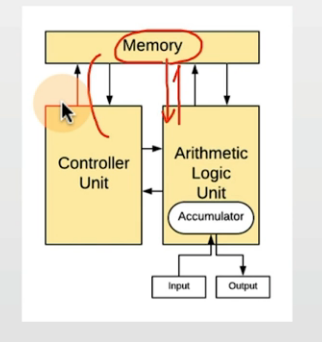

### 가상 메모리가 필요한 이유
- 하나의 프로세스만 실행 가능한 시스템(배치 처리 시스템등)
    - 프로그램을 메모리로 로드(load)
    - 프로세스 실행
    - 프로세스 종료 (메모리 해제)

- 여러 프로세스 동시 실행 시스템
    - 메모리 용량 부족 이슈
    - 프로세스 메모리 영역간에 침범 이슈

### 가상 메모리
- 가상 메모리: 메모리가 실제 메모리보다 많아 보이게 하는 기술
    - 실제 사용하는 메모리는 작다는 점에 착안해서 고안된 기술
    - 프로세스간 공간 분리로, 프로세스 이슈가 전체 시스템에 영향을 주지 않을 수 있음

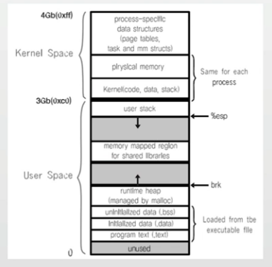

### 가상 메모리(Virtual Memory System)
- 가상 메모리 기본 아이디어
    - 프로세스는 가상 주소를 사용하고, 실제 해당 주소에서 데이터를 읽고/쓸때만 물리 주소로 바꿔주면 된다.
    - virtual address(가상 주소): 프로세스가 참조하는 주소
    - physical address(물리 주소): 실제 메모리 주소

- MMU(Memory Management Unit)
    - CPU에 코드 실행 시, 가상 주소 메모리 접근이 필요할 때, 해당 주소를 물리 주소값으로 변환해주는 하드웨어 장치

- 메인 메모리에 실제 각 프로세스의 데이터가 조각으로 씌여 있다.

> OS.xlsx -> Virtual MemorySystem2

### 가상 메모리 (Virtual Memory System)와 MMU
- CPU는 가상 메모리를 다루고, 실제 해당 주소 접근 시 MMU 하드웨어 장치를 통해 물리 메모리 접근
    - 하드웨어 장치를 이용해야 주소 변환이 빠르기 때문에 별도 장치를 둠

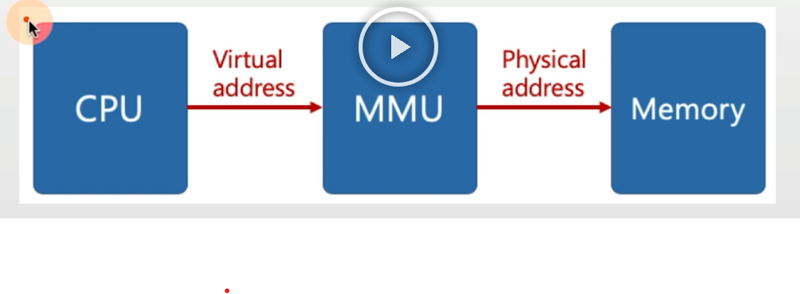

## 페이징 시스템(paging system)
- 페이징(paging) 개념
    - 크기가 동일한 페이지로 가상 주소 공간과 이에 매칭하는 물리 주소 공간을 관리
    - 하드웨어 지원이 필요
        - 예) Intel x86 시스템(32bit)에서는 4KB, 2MB, 1GB 지원
    - 리눅스에서는 4KB로 paging
    - 페이지 번호를 기반으로 가상 주소/물리 주소 매핑 정보를 기록/사용

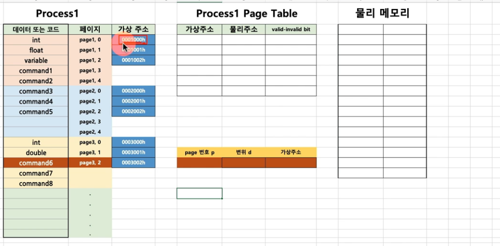

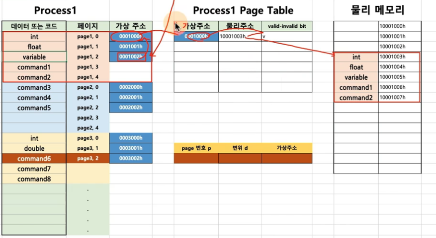

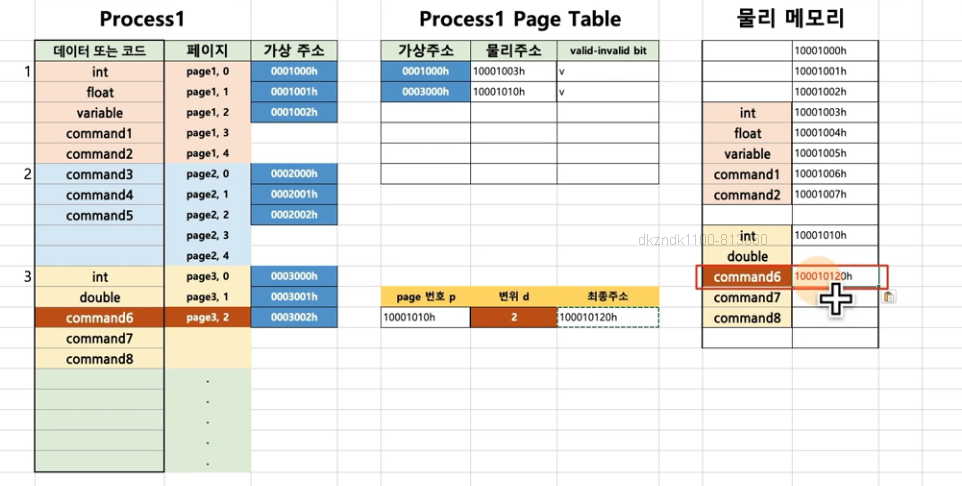

### 페이징 시스템 구조
- page 또는 page frame: 고정된 크기의 block (4KB)
- paging system
    - 가상 주소 v = (p,d)
    - p: 가상 메모리 페이지
    - d: p안에서 참조하는 위치

- 페이지 크기가 4KB 예
    - 가상 주소의 0비트에서 11비트가 변위(d)를 나타냄
    - 12비트 이상이 페이지 번호가 될 수 있음

### 참고: 모든 것은 결국 bit와 연결
- 본래 프로세스가 4GB를 사용했던 이유 - 32bit 시스템에서의 2의 32승이 4GB

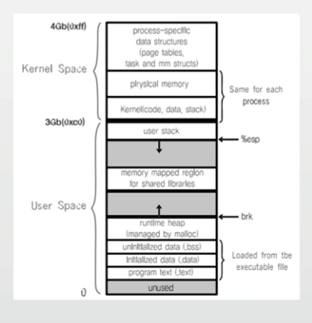

### 현업, IT 기술과 컴퓨터 공학의 이해
- 윈도우즈 64bit / 32bit 시스템
    - 주소를 2^64, 2^32 사용

### 페이지 테이블(page table)
- page table
    - 물리 주소에 있는 페이지 번호와 해당 페이지의 첫 물리 주소 정보를 매핑한 표
    - 가상 주소 v = (p, d) 라면
        - p(페이지 번호) : 페이지 번호
        - d(변위) : 페이지 처음부터 얼마 떨어진 위치인지
    - valid-invalid bit 가 v라면 => 물리 주소에 올라가 있는 상태
- paging system 동작
    - 해당 프로세스에서 특정 가상 주소 액세스를 하려면
        - 해당 프로세스의 page table에 해당 가상 주소가 포함된 page 번호가 있는지 확인
        - page 번호가 있으면 이 page가 매핑된 첫 물리 주소를 알아내고 (p')
        - p` + d가 실제 물리주소가 됨.

### 페이징 시스템과 MMU(컴퓨터 구조)
- CPU는 가상 주소 접근 시
    - MMU 하드웨어 장치를 통해 물리 메모리 접근

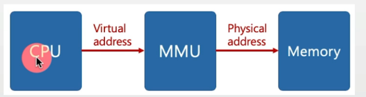

- 프로세스 생성시, 페이지 테이블 정보 생성
    - PCB 등에서 해당 페이지 테이블 접근 가능하고, 관련 정보는 물리 메모리에 적재
    - 프로세스 구동시, 해당 페이지 테이블 base 주소가 별도 레지스터에 저장(CR3)
    - CPU가 가상 주소 접근 시, MMU가 페이지 테이블 base 주소를 접근해서, 물리 주소를 가져옴

### 참고: 다중 단계 페이징 시스템
> 미리 페이징 정보를 만들어 놓지 않고, 특정 페이징 주소 영역(디렉토리)에 대해서만 만들어 놓는다.

- 32 bit 시스템에서 4KB 페이지를 위한 페이징 시스템은
    - 하위 12bit는 오프셋
    - 상위 20bit가 페이징 번호이므로, 2의 20승(1048576)개의 페이지 정보가 필요함

- 페이징 정보를 단계를 나누어 생성
    - 필요없는 페이지는 생성하지 않으면, 공간 절약 가능

- 페이지 번호를 나타내는 bit를 구분해서, 단계를 나눔 (리눅스는 3단계, 최근 4단계)

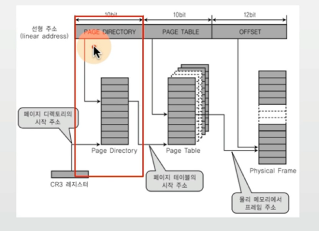

### MMU와 TLB(컴퓨터 구조)
- MMU가 물리 주소를 확인하기 위해 메모리를 갔다와야 함

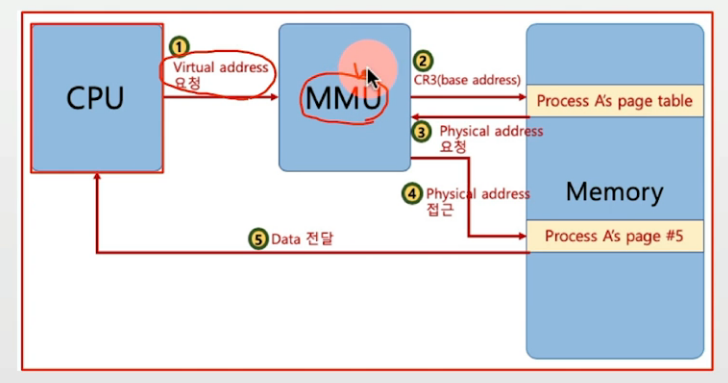

> 현업, IT 기술과 컴퓨터공학의 이해
>
> 메모리 계층 구조상, 메모리 접근이 CPU 측면에서는 상당한 시간이 걸림 (예: 200 cycle)

- TLB(Translation Lookaside Buffer): 페이지 정보 캐쉬

### 페이징 시스템과 공유 메모리 (IPC)
- 프로세스간 동일한 물리 주소를 가리킬 수 있음 (공간 절약, 메모리 할당 시간 절약)

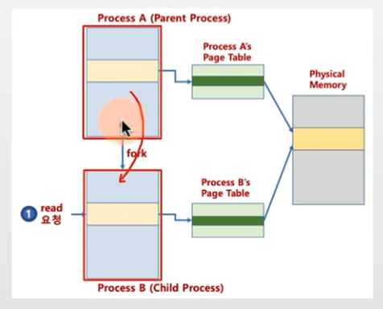

### 리눅스 (ls 명령어)예시
1. 리눅스는 부팅시에 init()이라는 프로세스가 자동으로 생성 되어진다.

2. shell 실행 => shell 프로세스 실행
3. ls 명령어 타이핑 => 실행.
4. shell 프로세스와 페이지 테이블 구조를 복사(fork)하여 ls를 실행하는데 필요한 코드와 데이터를 테이블 정보에 기입시켜주면 ls 명령어 실행
5. 필요한 정보를 반환
6. ls 프로세스 종료.

## 요구페이징

### 요구페이징(Demand Paging 또는 Demanded Paging) 
- 프로세스 모든 데이터를 메모리로 적재하지 않고, 실행 중 필요한 시점에서만 메모리로 적재함
    - 선행 페이징(anticipatory paging 또는 prepaging)의 반대 개념: 미리 프로세스 관련 모든 데이터를 메모리에 올려놓고 실행하는 개념
    - 더 이상 필요하지 않은 페이지 프레임은 다시 저장매체에 저장 (페이지 교체 알고리즘 필요)

### 페이지 폴트 (page fault)
- 어떤 페이지가 실제 물리 메모리에 없을 때 일어나는 인터럽트
- 운영체제가 page fault가 일어나면, 해당 페이지를 물리 메모리에 올림

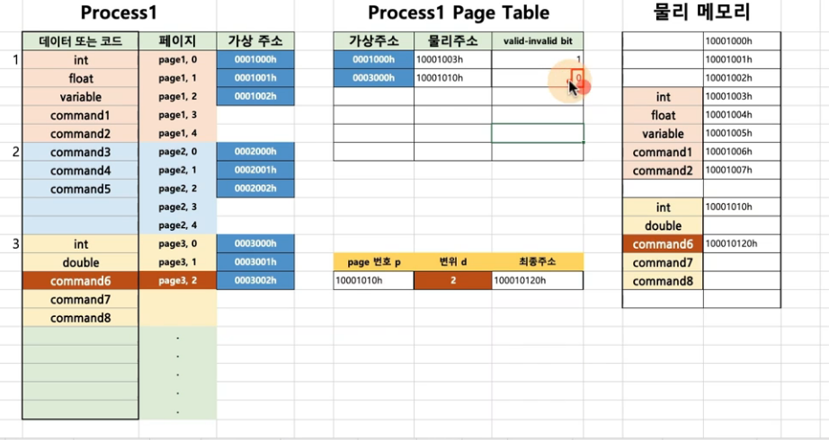

### 페이지 폴트와 인터럽트

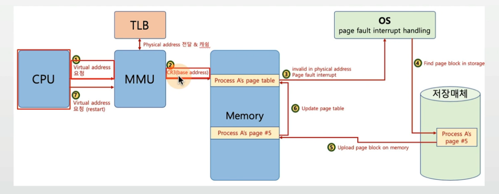

### 사용자 / 커널 모드와 프로세스, 인터럽트

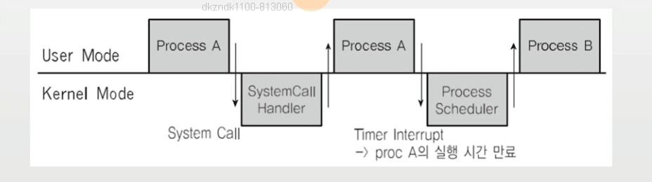

### 인터럽트와 IDT
- 인터럽트는 미리 정의되어 각각 번호와 실행 코드를 가리키는 주소가 기록되어 있음
    - 어디에? IDT(Interrupt Descriptor Table)에 기록
    - 언제? 컴퓨터 부팅시 운영체제가 기록
    - 어떤 코드? 운영체제 내부 코드

- 다시 예를 보면
    - 항상 인터럽트 발생시 IDT 확인
    - 시스템콜 인터럽트 명령은 0x80 번호가 미리 정의
    - 인터럽트 0x80에 해당하는 운영체제 코드는 system_call()이라는 함수
    - 즉, IDT에는 0x80 -> systewm_call()와 같은 정보가 기록되어 있음.

### 페이지 폴트(page fault)
- 어떤 페이지가 실제 물리 메모리에 없을 때 일어나는 인터럽트
- 운영체제가 page fault가 일어나면, 해당 페이지를 물리 메모리에 올림.

### 생각해보기
- 페이지 폴트가 자주 일어나면?
    - 실행되기 전에, 해당 페이지를 물리 메모리에 올려야 함
        - 시간이 오래 걸림

- 페이지 폴트가 안 일어나게 하려면?
    - 향후 실행 / 참조될 코드 / 데이터를 미리 물리 메모리에 올리면 됨
        - 앞으로 있을 일을 예측해야 함 - 신의 영역
    

## 페이지 교체 정책 (page replacement policy)
- 운영체제가 특정 페이지를 물리 메모리에 올리려 하는데, 물리 메모리가 다 차있다면?
    - 기존 페이지 중 하나를 물리 메모리에서 저장 매체로 내리고(저장)
    - 새로운 페이지를 해당 물리 메모리 공간에 올린다

> 어떤 페이지를 물리 메모리에서, 저장 매체로 내릴 것인가? -> Page Replacement(Swapping) Algorithm

### 페이지 교체 알고리즘(FIFO)
- FIFO Page Replacement Algorithm
    - 가장 먼저 들어온 페이지를 내리자

> OS.xlsx -> RealDemandPaging-FIFO

### 페이지 교체 알고리즘(OPT)
- 최적 페이지 교체 알고리즘(OPTimal Replacement Algorithm)
    - 앞으로 가장 오랫동안 사용하지 않을 페이지를 내리자
    - 일반 OS에서는 구현 불가

> OS.xlsx -> RealDemandPaging-OPT-NUR

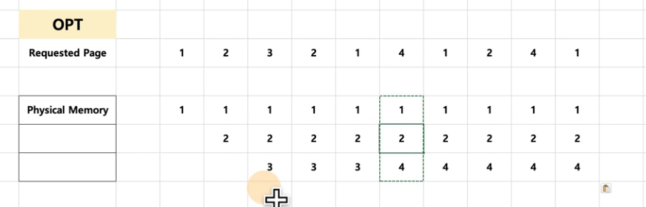

### 페이지 교체 알고리즘(LRU)
- LRU(Least Recently Used) Page Replacement Algorithm
    - 가장 오래 전에 사용된 페이지를 교체
    - OPT 교체 알고리즘이 구현이 불가하므로, 과거 기록을 기반으로 시도

> OS.xlsx --> RealDemandPaging-OPT-NUR

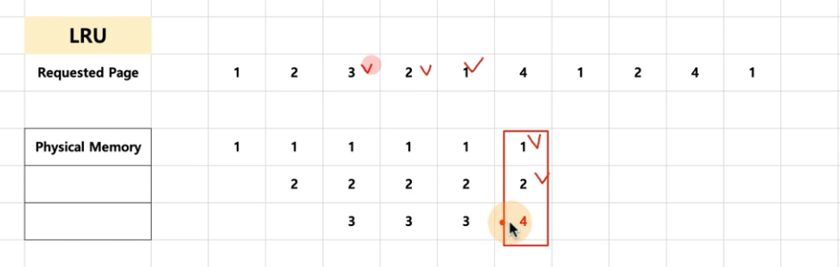

### 페이지스왑알고리즘 (LFU)
- LFU(LeastFrequentlyUsed) PageReplacementAlgorithm
- 가장적게사용된페이지를내리자

> OS.xlsx ‑‑> RealDemandPaging‑OPT~NUR

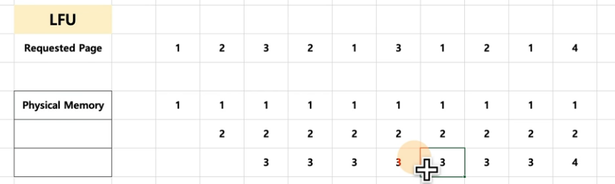

### 페이지 스왑 알고리즘(NUR)
- NUR(Not Used Recently) Page Replacement Algorithm
    - LRU와 마찬가지로 최근에 사용하지 않은 페이지부터 교체하는 기법
    - 각페이지마다 참조 비트(R), 수정 비트(M)을 둠 (R,M)
        - (0, 0), (0, 1), (1, 0), (1, 1)순으로 페이지 교체

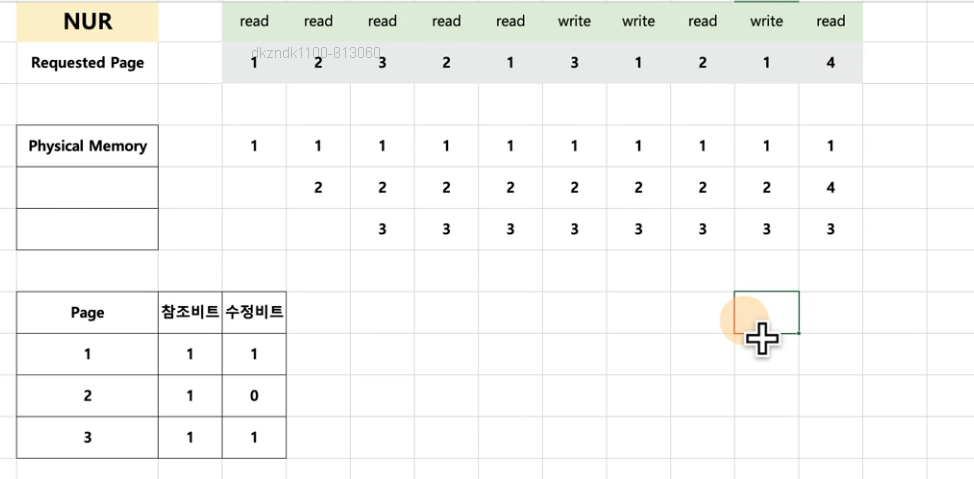

### 현업 IT 기술과 컴퓨터 공학의 이해
- 메모리 지역성

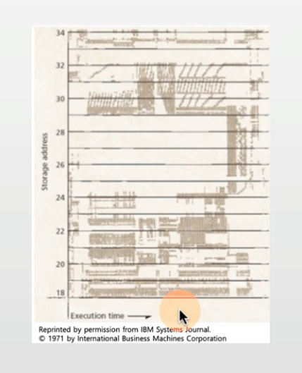

- 스레싱(Thrashing)
    - 반복적으로 페이지 폴트가 발생해서, 과도하게 페이지 교체 작업이 일어나, 실제로는 아무일도 하지 못하는 상황

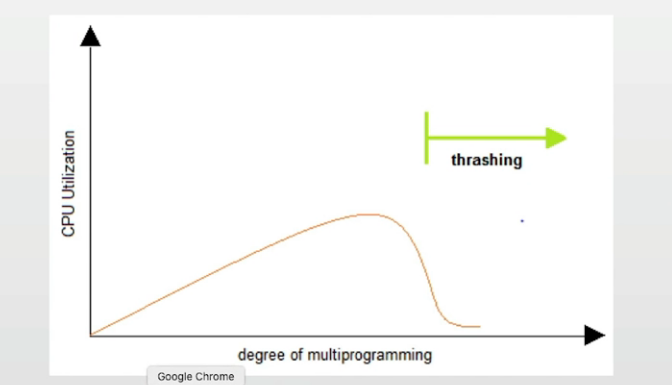

### 기술면접 운영체제 단골 문제 정복

