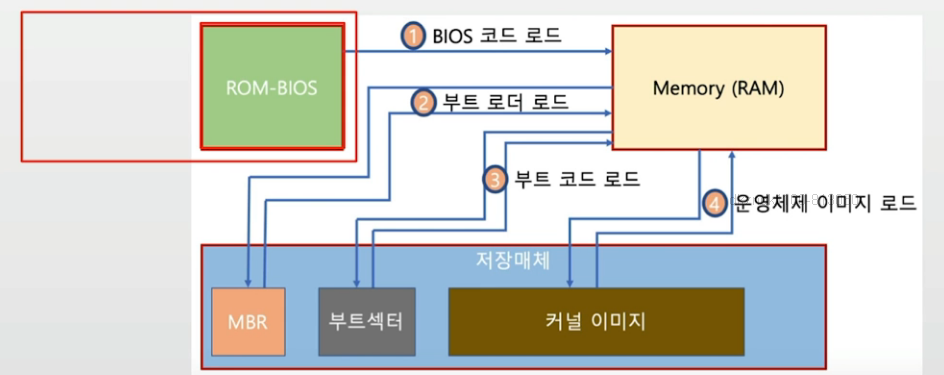

## Boot
- 컴퓨터를 켜서 동작시키는 절차
- Boot 프로그램
    - 운영체제 커널을 Storage에서 특정 주소의 물리 메모리로 복사하고 커널의 처음 실행위치로 PC를 가져다 놓는 프로그램

```
부팅 프로그램은 마지막에
CPU의 pc 레지스터에 
커널 프로그램의 첫 출발 주소를 옮겨 놓는다.
```

### 부팅 과정
- 컴퓨터를 키면
    - BIOS가 특정 Storage 읽어와 bootstrap loader를 메모리에 올리고 실행함
    - bootstrap loader 프로그램이 있는 곳을 찾아서 실행시킴

1. 특정 ROM의 BIOS 코드를 RAM(메모리)에 로드시키고 컴퓨터가 실행시킨다.
2. 저장 매체의 특정 주소로 점프한다.
3. 해당 주소의 코드를 RAM(메모리)에 로드된다.
=> 이때 부때 로드되는 프로그램이 부트 로더이다. 
4. 부트 로더는 부트섹터가 있는 특정 주소로 가서 부트 프로그램에서 필요한 부분 만큼의 코드를 메모리로 가져온다.
5. 부트 프로그램은 커널 이미지(binary code)를 메모리로 올리고 실행시킨다.
6. 부팅 과정이 끝난다.


