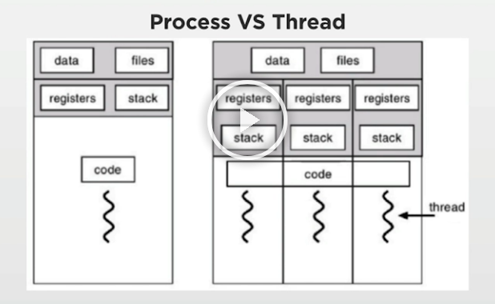
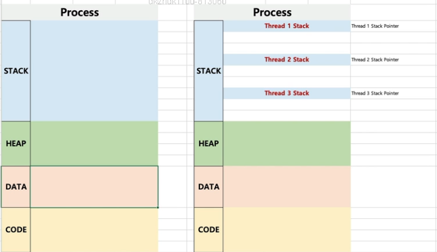
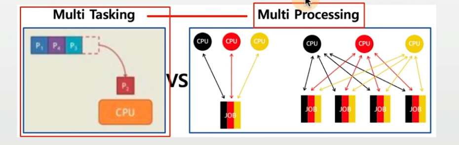
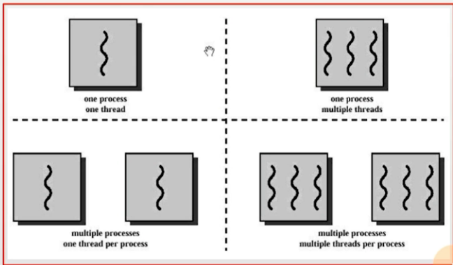
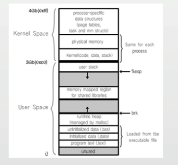
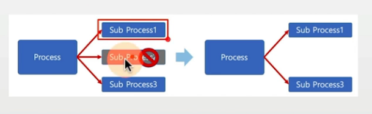
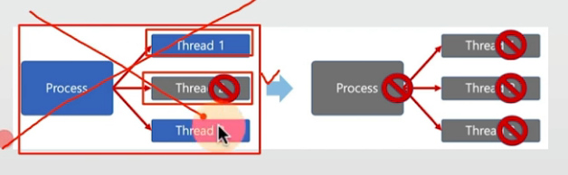
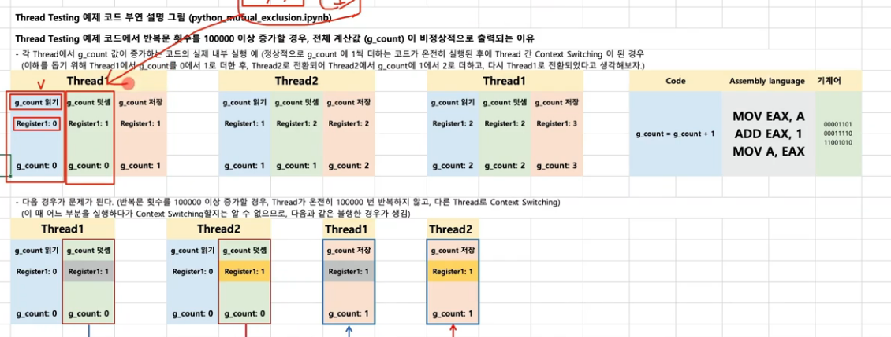
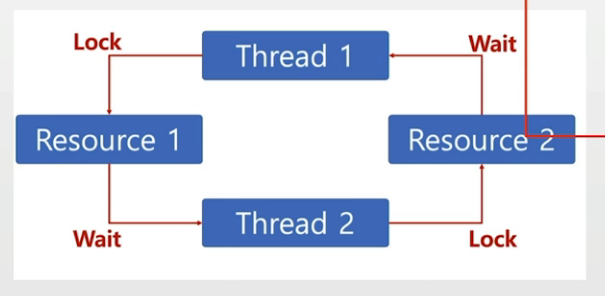

## 목차
1. [스레드의 개념](#스레드)
2. [스레드의 장단점](#스레드의-장단점)
3. [스레드 동기화이슈](#스레드의-동기화)
4. [deadlock과 Starvation](#교착상태deadlock와-기아상태starvation)

## 스레드

### 목표
1. 프로세스간에는 어떻게 통신하는지, 쓰레드와 비교해서 가능한 상세하게 설명

2. 프로세스와 쓰레드간의 차이점에 대해 설명

3. 언제 멀티 프로세스를 사용하고, 언제 멀티 
쓰레드를 써야하는지 가능한 구체적으로 설명

4. 쓰레드 동기화란 무엇이며 왜 사용해야 하는지 예시를 들어 설명

5. 뮤텍스와 세마포어의 차이점에 대해 간략히 설명

### Thread (스레드)
- Light Weight Process 라고도 함
- 프로세스
    - 프로세스 간에는 각 프로세스의 데이터 접근이 불가
- 스레드
    - 하나의 프로세스에 여러개의 스레드 생성 가능
    - 스레드들은 동시에 실행 가능
    - 프로세스 안에 있으므로, 프로세스의 데이터를 모두 접근

### Multi Thread (멀티 스레드)
- 소프트웨어 병행 작업 처리를 위해 Multi Thread를 사용함.


### 현업, IT 기술과 컴퓨터공학의 이해
- 대부분의 프로그래밍 언어에서 중급 이후 과정에서는 반드시 나오는 기술이 Thread 프로그래밍 기법
    - 예: JAVA 언어에서도 Thread 프로그래밍 기법은 많이 사용되는 기술 중 하나임
- 멀티 프로세스와 멀티 Thread 프로그래밍은 성능 개선을 위해, 기본적으로 고려하는 구조임

### Thread(스레드)
> Thread는 각기 실행이 가능한 stack 존재



> OS.xlsx => Thread



### 멀티 프로세싱과 Thread
- 멀티 태스킹과 멀티 프로세싱



- 최근 CPU는 멀티 코어를 가지므로, Thread를 여러 개 만들어, 멀티 코어를 활용도를 높임

> 하나의 프로세스에서 실행되어야 할 작업들을 여러 개로 분리한 후에 각각의 CPU 코어에 넣어서 병행해서 실행하게끔 만들어 주는 스케쥴링 기법이 멀티 프로세싱의 목적
>
> 이때 작업을 어떻게 분리할 것인가?? => Thread를 지원해서 여러 코어에 필요한 Thread를 프로세스에서 분리하여 각 코어에서 실행하게 만들면 멀티프로세싱이 구현된 것.

### 현업, IT 기술과 컴퓨터공학의 이해
- 최근에는 짧은 반응 시간이 우선이기 때문에, 성능 개선에 신경을 많이 쓰므로,
    - 멀티 프로세스 또는 멀티 쓰레드를 고려함
- 멀티 프로세스보다 쓰레드를 자연스럽게 더 많이 사용함
    - 멀티 프로세스는 처음 구조를 잡을 때 만들어야 하지만,
    - 쓰레드는 프로그램의 일부 동작에서만 사용하도록 일부 코드 수정으로 가능하기 때문임

### 멀티 프로세스와 멀티 Thread




## 스레드의 장단점

### Thread 장점1
1. 사용자에 대한 응답성 향상


2. 자원 공유 효율
    - IPC 기법과 같이 프로세스간 자원 공유를 위해 번거로운 작업이 필요 없음
    - 프로세스 안에 있으므로, 프로세스의 데이터를 모두 접근 가능



3. 작업이 분리되어 코드가 간결
- 사실 작성하기 나름

### Thread 단점
- 스레드 중 한 스레드만 문제가 있어도, 전체 프로세스가 영향을 받음
- 멀티 프로세스


- 멀티 스레드


- 스레드를 많이 생성하면, Context Switching이 많이 일어나, 성능 저하
- 예: 리눅스 OS에서는 Thread를 Process와 같이 다룸.
    - 스레드를 많이 생성하면, 모든 스레드를 스케쥴링해야 하므로, Context Switching이 빈번할 수밖에 없음
    - 그러나 이는 멀티 프로세스도 비슷한 문제가 있으므로, Case에 따라 달라질 수 있음.

### Thread 중요 단점 : 동기화 이슈로 비정상적으로 동작 가능
- 동기화 코드를 적절히 추가해줘야함.


### Thread vs Process
- 프로세스는 독립적, 스레드는 프로세스의 서브셋
- 프로세스는 각각 독립적인 자원을 가짐, 스레드는 프로세스 자원 공유
- 프로세스는 자신만의 주소영역을 가짐. 스레드는 주소 영역 공유
- 프로세스간에는 IPC 기법으로 통신해야 함. 스레드는 필요 없음

### 정리
- Thread 개념 정리
    - 프로세스와 달리 스레드간 자원 공유

- 스레드 장점
    - 성능 개선 가능
    - 응답성 향상
    - 자원 공유 효율 (IPC를 안써도 됨)

- 스레드 단점
    - 하나의 스레드 문제가, 프로세스 전반에 영향을 미침
    - 동기화 이슈

## 스레드의 동기화
> 동기화 (synchronization)

### 동기화(synchronization) 이슈
- 동기화 : 작업들 사이에 실행 시기를 맞추는 것
- 여러 스레드가 동일한 자원(데이터) 접근 시 동기화 이슈 발생
    - 동일 자원을 여러 스레드가 동시 수정시, 각 스레드 결과에 영향을 줌

### 이슈 상황
> 어셈블리 레벨에서 컴퓨터는 Thread 단위로 Context Switching을 할지 알 수 없다.
>
> Thread의 작업 단위
>
> 1. g_count 읽기
> 2. g_count 더하기
> 3. g_count 저장하기
>
> 연산 횟수가 많아지는 경우 Thread의 작업단위가 끝나고 Context Switching을 하는 것이 아닌, 컴퓨터는 1번과 2번 3번 도중에 Context Switching이 발생하여 값이 누락될 수 있다.
>
> 예시 => Thread 1번, 2번, 3번이 있다고 가정할 때 Thread 1의 2번 작업 후 3번 작업 이전에 Thread 2의 1번 작업으로 Context Switching 되어 진다. 

```python
# code level
g_conut = g_count + 1

# Assembly level
MOV EAX, A # g_count 읽기
ADD EAX, 1 # g_count에 1 더하기
MOV A, EAX # g_count에 값 저장하기.

# machine level
# 00001101
# 00011110
# 11001010
```



### 동기화 이슈 해결 방안
- Mutual exclusion(상호 배제)
- 쓰레드는 프로세스 모든 데이터를 접근할 수 있으므로
    - 여러 스레드가 변경하는 공유 변수에 대해 Exclusive Access 필요
    - 어느 한 스레드가 공유 변수를 갱신하는 동안 다른 스레드가 동시 접근하지 못하도록 막기.

### Mutual exclusion (상호 배제)
> 임계 영역이 동작하는 thread가 있다면 다른 thread는 해당 임계 영역에서 대기 후 끝난 뒤에 작업을 실행한다.

- 임계 자원(critical resource)
- 임계 영역(critical section)

```python
lock.acquire()
# 임계 영역
for i in range(100000):
    # 임계 자원
    g_count += 1
#- 임계 영역 끝
lock.release()
```

### 현업, IT 기술과 컴퓨터공학의 이해
- 쓰레드는 자주 일부 기능에 한해서 사용
- 쓰레드 구현시 동기화 코드 까먹는 경우 있음 (코드가 복잡하므로, 어디에서 동기화 이슈가 일어날지 놓치는 경우가 있음)
    - 하지만, 비정상동작시, 이것이 동기화 이슈구나는 바로 인지하고,
    - 관련 코드를 찾아서 상호배제 코드를 넣을 수 있어야 함.


### Mutex와 세마포어 (Semaphore)
- Critical Section(임계 구역)에 대한 접근을 막기 위해 LOCKING 메커니즘이 필요
    - Mutex(binary semaphore) : 임계구역에 하나의 스레드만 들어갈 수 있음
    - Semaphore : 임계구역에 여러 스레드가 들어갈 수 있음<br>
    : counter를 두어서 동시에 리소스에 접근 할 수 있는 허용 가능한 스레드 수를 제어
    : <br> Semaphore의 counter를 1개로 설정하면 Mutex와 동일함.

### 현업 팁
- 각 언어, 프레임 워크 별 동기화 라이브러리/함수 제공


## 교착상태(Deadlock)와 기아상태(Starvation)

### 교착상태(deadlock)란?
- 무한 대기 상태: 두 개 이상의 작업이 서로 상대방의 작업이 끝나기 만을 기다리고 있기 때문에, 다음 단계로 진행하지 못하는 상태



> 배치 처리 시스템에서는 일어나지 않는 문제
>
> 프로세스, 스레드 둘다 이와 같은 상태가 일어날 수 있음

### 현업, IT 기술과 컴퓨터공학의 이해
- 휴대폰에서 특정 앱이 실행중 동작이 안될 때
    - 이유 중 하나가 데드락일 경우가 있음
    - 이를 디버깅하기 위해, 데드락이 무엇인지 이해가 필요함
    - 운영체제가 해당 앱이 특정 기간동안 반응이 없으면, 강제 종료시킴

### 기아상태(starvation)
- 특정 프로세스의 우선순위가 낮아서 원하는 자원을 계속 할당 받지 못하는 상태
- 교착상태와 기아상태
    - 교착상태는 여러 프로세스가 동일 자원 점유를 요청할 때 발생
    - 기아상태는 여러 프로세스가 부족한 자원을 점유하기 위해 경쟁할 때, 특정 프로세스는 영원히 자원 할당이 안되는 경우를 주로 의미
