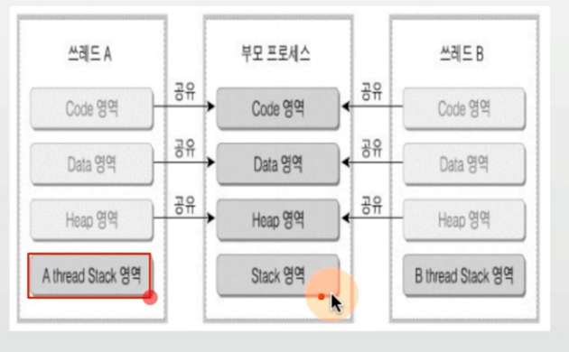

## 목차
1. [스레드의 개념](#스레드)
2. [스레드의 장단점](#스레드의-장단점)

## 스레드

### 목표
1. 프로세스간에는 어떻게 통신하는지, 쓰레드와 비교해서 가능한 상세하게 설명

2. 프로세스와 쓰레드간의 차이점에 대해 설명

3. 언제 멀티 프로세스를 사용하고, 언제 멀티 
쓰레드를 써야하는지 가능한 구체적으로 설명

4. 쓰레드 동기화란 무엇이며 왜 사용해야 하는지 예시를 들어 설명

5. 뮤텍스와 세마포어의 차이점에 대해 간략히 설명

### Thread (스레드)
- Light Weight Process 라고도 함
- 프로세스
    - 프로세스 간에는 각 프로세스의 데이터 접근이 불가
- 스레드
    - 하나의 프로세스에 여러개의 스레드 생성 가능
    - 스레드들은 동시에 실행 가능
    - 프로세스 안에 있으므로, 프로세스의 데이터를 모두 접근

### Multi Thread (멀티 스레드)
- 소프트웨어 병행 작업 처리를 위해 Multi Thread를 사용함.

### 현업, IT 기술과 컴퓨터공학의 이해
- 대부분의 프로그래밍 언어에서 중급 이후 과정에서는 반드시 나오는 기술이 Thread 프로그래밍 기법
    - 예: JAVA 언어에서도 Thread 프로그래밍 기법은 많이 사용되는 기술 중 하나임
- 멀티 프로세스와 멀티 Thread 프로그래밍은 성능 개선을 위해, 기본적으로 고려하는 구조임

### Thread(스레드)
> Thread는 각기 실행이 가능한 stack 존재

> OS.xlsx => Thread

### 멀티 프로세싱과 Thread
- 멀티 태스킹과 멀티 프로세싱

- 최근 CPU는 멀티 코어를 가지므로, Thread를 여러 개 만들어, 멀티 코어를 활용도를 높임

> 하나의 프로세스에서 실행되어야 할 작업들을 여러 개로 분리한 후에 각각의 CPU 코어에 넣어서 병행해서 실행하게끔 만들어 주는 스케쥴링 기법이 멀티 프로세싱의 목적
>
> 이때 작업을 어떻게 분리할 것인가?? => Thread를 지원해서 여러 코어에 필요한 Thread를 프로세스에서 분리하여 각 코어에서 실행하게 만들면 멀티프로세싱이 구현된 것.

### 현업, IT 기술과 컴퓨터공학의 이해
- 최근에는 짧은 반응 시간이 우선이기 때문에, 성능 개선에 신경을 많이 쓰므로,
    - 멀티 프로세스 또는 멀티 쓰레드를 고려함
- 멀티 프로세스보다 쓰레드를 자연스럽게 더 많이 사용함
    - 멀티 프로세스는 처음 구조를 잡을 때 만들어야 하지만,
    - 쓰레드는 프로그램의 일부 동작에서만 사용하도록 일부 코드 수정으로 가능하기 때문임

### 멀티 프로세스와 멀티 Thread

## 스레드의 장단점

### Thread 장점1
1. 사용자에 대한 응답성 향상

2. 자원 공유 효율
    - IPC 기법과 같이 프로세스간 자원 공유를 위해 번거로운 작업이 필요 없음
    - 프로세스 안에 있으므로, 프로세스의 데이터를 모두 접근 가능

3. 작업이 분리되어 코드가 간결
- 사실 작성하기 나름

### Thread 단점
- 스레드 중 한 스레드만 문제가 있어도, 전체 프로세스가 영향을 받음
- 멀티 프로세스

- 멀티 스레드

- 스레드를 많이 생성하면, Context Switching이 많이 일어나, 성능 저하
- 예: 리눅스 OS에서는 Thread를 Process와 같이 다룸.
    - 스레드를 많이 생성하면, 모든 스레드를 스케쥴링해야 하므로, Context Switching이 빈번할 수밖에 없음
    - 그러나 이는 멀티 프로세스도 비슷한 문제가 있으므로, Case에 따라 달라질 수 있음.

### Thread 중요 단점 : 동기화 이슈로 비정상적으로 동작 가능
- 동기화 코드를 적절히 추가해줘야함.

### Thread vs Process
- 프로세스는 독립적, 스레드는 프로세스의 서브셋
- 프로세스는 각각 독립적인 자원을 가짐, 스레드는 프로세스 자원 공유
- 프로세스는 자신만의 주소영역을 가짐. 스레드는 주소 영역 공유
- 프로세스간에는 IPC 기법으로 통신해야 함. 스레드는 필요 없음

### 정리
- Thread 개념 정리
    - 프로세스와 달리 스레드간 자원 공유

- 스레드 장점
    - 성능 개선 가능
    - 응답성 향상
    - 자원 공유 효율 (IPC를 안써도 됨)

- 스레드 단점
    - 하나의 스레드 문제가, 프로세스 전반에 영향을 미침
    - 동기화 이슈