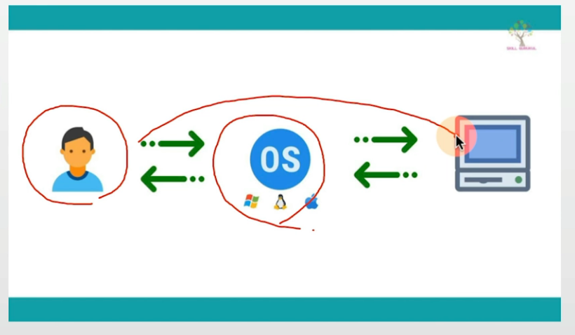
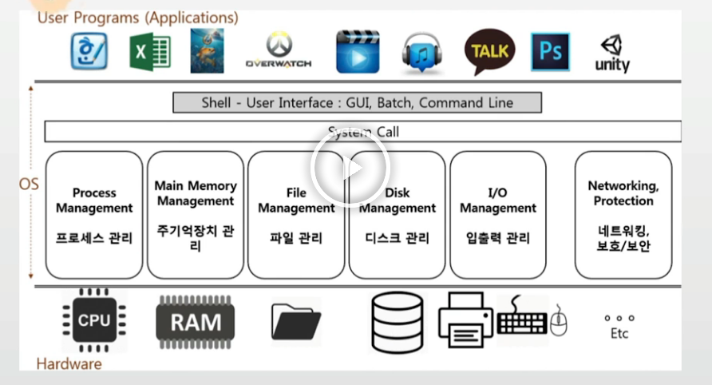
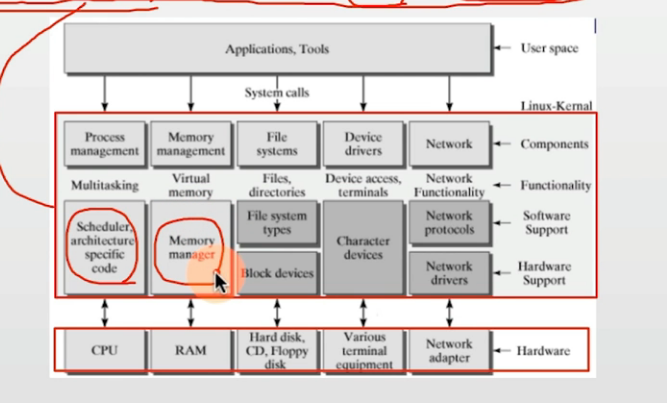
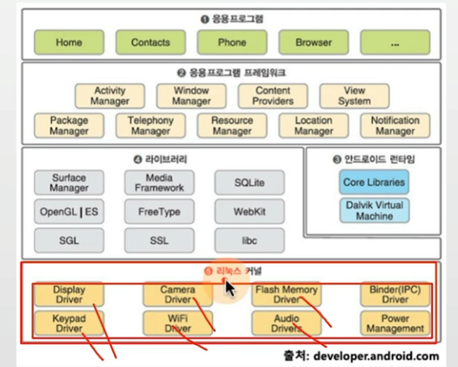
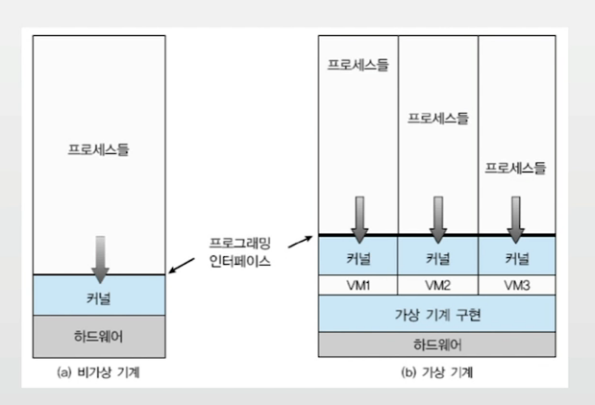
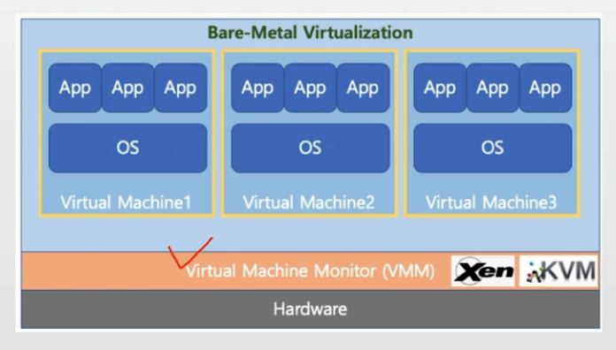
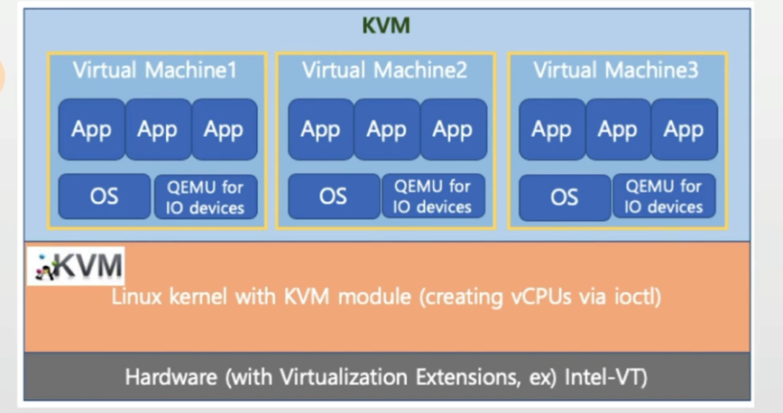
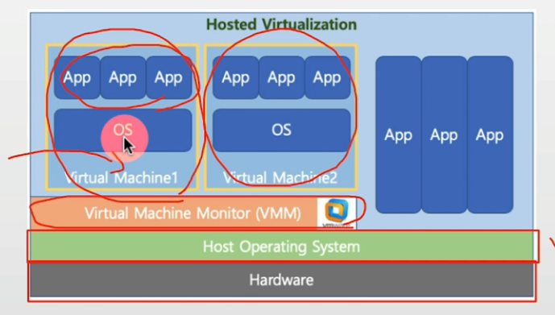
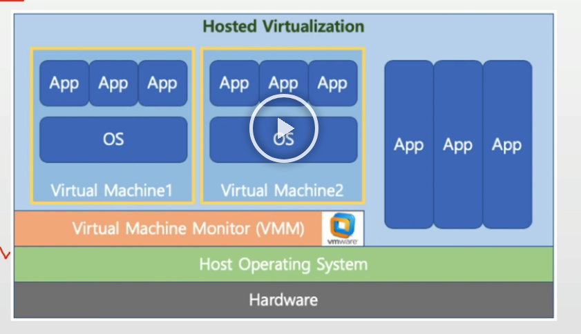

## 목차
- [운영체제의 개념](#운영체제의-개념)
- [운영체제의 역할](#운영체제의-역할)
- [운영체제의 구조](#운영체제-구조-이해)
- [가볍게 이해하기: Virtual Machine (가상머신)](#가볍게-이해하기-virtual-machine-가상머신)

## 운영체제의 개념

### 운영체제란?
- 운영체제란: OS (Operating System)
- 주요 운영체제: 윈도우, UNIX 계열 OS (리눅스), MacOS 

### 사용자, 응용 프로그램, 운영체제, 컴퓨터 하드웨어와 관계
- OS는 더 정확히는 커널(kernel)을 의미함


> 일반적으로 커널에 여러가지가 추가된 상태를, OS라고 통칭함.


### 안드로이드는 OS 일까요?
> kernel 과 프로그램 사이에 많은 시스템 프로그램과 함수(라이브러리)들이 존재

- [안드로이드 참고](https://ko.wikipedia.org/wiki/%EC%95%88%EB%93%9C%EB%A1%9C%EC%9D%B4%EB%93%9C_(%EC%9A%B4%EC%98%81_%EC%B2%B4%EC%A0%9C))

## 운영체제의 역할

### 운영체제 역할1: 시스템 자원(System Resource) 관리자
- 시스템 자원(System Resource) = 컴퓨터 하드웨어
    - CPU(중앙처리장치), Memory(DRAM, RAM)
    - I/O Devices(입출력장치)
        - Monitor, Mouse, Keyboard, Network
    - 저장매체: SSD, HDD(하드디스크) 
> 모든 하드웨어 자원은 운영체제(kernel)이 제어한다.

### 운영체제 역할1
1. CPU: 각 프로그램이 얼마나 CPU를 사용할지를 결정할 수 없다.
2. Memory 각 프로그램이 어느 주소에 저장되어야 하는지, 어느 정도의 메모리 공간을 확보해줘야 하는지를 결정할 수 없음.
3. 저장매체(HDD, SSD): 어떻게, 어디에 저장할지를 결정할 수 없음.
4. 키보드/마우스: 스스로 표시할 수는 없음.

### 운영체제 역할2: 사용자와 컴퓨터간의 커뮤니케이션 지원



### 운영체제 역할3: 응용 프로그램 제어



### 정리
1. 운영체제 역할 1: 시스템 자원(System Resource) 관리자
2. 운영체제 역할 2: 사용자와 컴퓨터간의 커뮤니케이션 지원
3. 운영체제 역할 3: 응용 프로그램 제어

### 응용프로그램이란?
- 프로그램 = 소프트웨어
- 소프트웨어 = 운영체제, 응용 프로그램(엑셀, 파워포인트, 사용자가 믿는 프로그램)
- 응용 프로그램 = Application (일반 PC에서의 프로그램) = App (스마트폰에서 응용 프로그램)

### 운영체제와 응용 프로그램간의 관계
- 운영체제는 응용 프로그램을 관리
    - 응용 프로그램 실행
    - 응용 프로그램간의 권한을 관리.
        - 관리자 권한으로 실행
    - 응용 프로그램을 사용하는 사용자도 관리
        - 로그인

- 응용 프로그램은 누구나 만들 수 있음.(가정 사례들)
    - 응용 프로그램에 무한 반복문을 넣었다.
    - 응용 프로그램을 잘 못 작성해서, 프로그램이 다운
    - 모든 파일 삭제 막기 (권한/사용자 관리)
    - 응용 프로그램이 욕심이 많아서, CPU를 자기만 쓰겠다 <-- 운영체제가 막는다.

> 그래서 운영체제는 응용 프로그램을 관리.

1. 응용 프로그램을 관리.
2. 시스템 자원(System Resource)를 관리.
3. 사용자와 컴퓨터간의 커뮤니케이션 지원

> 운영체제의 목표 : 사용자가 사용하는 응용 프로그램이 효율적으로, 적절하게 동작하도록 지원
>
> 운영체제는 응용 프로그램이 요청하는 시스템 리소스를 효율적으로 분배하고 지원하는 소프트웨어

### 정리
1. 운영체제의 역할: 시스템자원, 응용 프로그램 관리, 효율적 분배
2. 응용 프로그램이란? - 소프트웨어 (운영체제, 응용 프로그램)


## 운영체제 구조 이해

### 현업, IT 기술과 컴퓨터공학의 이해
- 실제 운영체제의 이해
    - 리눅스 운영체제
        - 리눅스 커널(운영체제) + 시스템 프로그램(쉘 + 응용프로그램)



- 안드로이드 스마트폰 (Android)
    - Linux Kernel + (Shell + Some basic programs) + Android Framework

```
보통 자바 라이브러리는
코드 작업을 통해 System call을 보내서
원하는 동작이 커널에서 동작하게끔 한다.
```



## 가볍게 이해하기: Virtual Machine (가상머신)
> 하나의 하드웨어(CPU, Memory등)에 다수의 운영체제를 설치하고, 개별 컴퓨터처럼 동작하도록 하는 프로그램



### Virtual Machine Type1 (native 또는 bare metal)
- 하이퍼 바이저(또는 VMM): 운영 체제와 응용프로그램을 물리적 하드웨어에서 분리하는 프로세스
- 하이퍼바이저 또는 버추얼 머신 모니터 (VMM)라고 하는 소프트웨어가 Hardware에서 직접 구동
    - Xen, KVM



### KVM
- AWS(아마존 클라우드 컴퓨팅 서비스)등에서 사용(Type1)



### Virtual Machine Type2
- 하이퍼바이저 또는 버추얼 머신 모니터(VMM)라고 하는 소프트웨어가 Host OS 상위에 설치
    - VMWare, VirtualBox



### VMWare
- VMWare : 대표적인 가상머신 프로그램(Type2)


