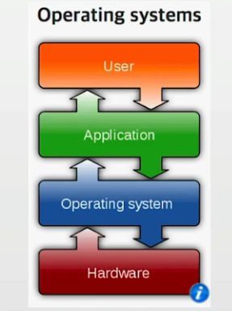
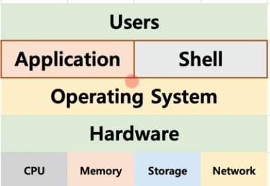

## 목차
- [운영체제의 개념](#운영체제의-개념)
- [커널과 쉘](#커널과-쉘)

## 운영체제의 개념

### 운영체제란?
- 운영체제란: OS (Operating System)
- 주요 운영체제: 윈도우, UNIX 계열 OS (리눅스), MacOS 

### 사용자, 응용 프로그램, 운영체제, 컴퓨터 하드웨어와 관계
- OS는 더 정확히는 커널(kernel)을 의미함

> 일반적으로 커널에 여러가지가 추가된 상태를, OS라고 통칭함.

### 안드로이드는 OS 일까요?
> kernel 과 프로그램 사이에 많은 시스템 프로그램과 함수(라이브러리)들이 존재

- [안드로이드 참고](https://ko.wikipedia.org/wiki/%EC%95%88%EB%93%9C%EB%A1%9C%EC%9D%B4%EB%93%9C_(%EC%9A%B4%EC%98%81_%EC%B2%B4%EC%A0%9C))

## 커널과 쉘

### 운영체제는 사용자 인터페이스 제공: 쉘
- 쉘 (Shell)
    - 사용자가 운영체제 기능과 서비스를 조직할 수 있도록 인터페이스를 제공하는 프로그램
    - 쉘은 터미널 환경(CLI)과, GUI 환경 두 종류로 분류
    - 유명한 쉘: 리눅스 bash

> [시스템 콜](https://namu.wiki/w/%EC%8B%9C%EC%8A%A4%ED%85%9C%20%EC%BD%9C)

### 운영체제의 간략한 구조

### 운영체제는 응용 프로그램 인터페이스 제공 : 시스템 콜
- 시스템 콜(System Call)
    - 시스템 콜 또는 시스템 호출 인터페이스
    - 운영체제가 운영체제 각 기능을 사용할 수 있도록 시스템 콜이라는 명령 또는 함수를 제공

> [운영체제](https://man7.org/linux/man-pages/man2/open.2.html)

### 프로그래밍 언어별 해당 운영체제에 맞는 API 구현
- API(Application Programming Interface)
    - 모호한 용어이지만, 간단히 함수 또는 라이브러리라고 이해하면 됨

- API 내부에는 필요시 해당 운영체제의 시스템콜을 호출하는 형태로 만들어짐

> 함수든 변수든 결국 주소가 있고, 해당 주소에서 코드를 실행하는 형태
>
> 참고 : SystemCall[System Call and API]

### 운영체제를 만든다면?
1. 운영체제를 개발한다. (kernel)
2. 시스템콜을 개발
3. 시스템콜 기반, 프로그래밍 언어별 라이브러리 개발(API)
4. 지원되는 프로그래밍 언어로 Shell 프로그램 개발
5. 지원되는 프로그래밍 언어로 응용 프로그램 개발