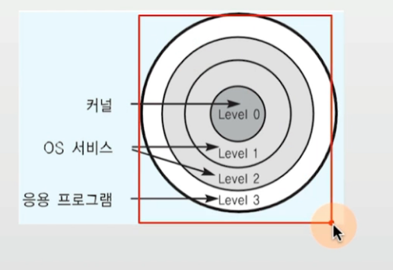
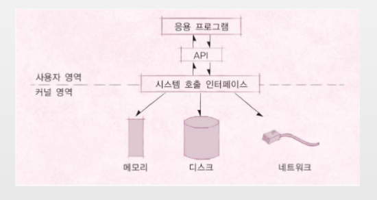
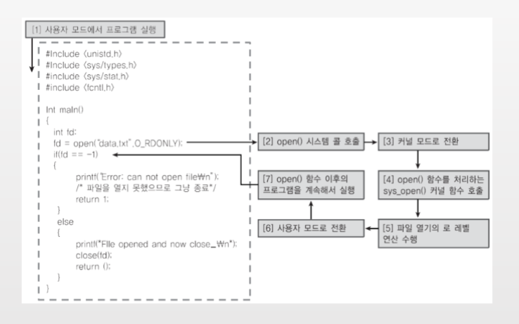

## 커널과 쉘

### 운영체제는 사용자 인터페이스 제공: 쉘
- 쉘 (Shell)
    - 사용자가 운영체제 기능과 서비스를 조직할 수 있도록 인터페이스를 제공하는 프로그램
    - 쉘은 터미널 환경(CLI)과, GUI 환경 두 종류로 분류
    - 유명한 쉘: 리눅스 bash

> [시스템 콜](https://namu.wiki/w/%EC%8B%9C%EC%8A%A4%ED%85%9C%20%EC%BD%9C)

### 운영체제의 간략한 구조

### 운영체제는 응용 프로그램 인터페이스 제공 : 시스템 콜
- 시스템 콜(System Call)
    - 시스템 콜 또는 시스템 호출 인터페이스
    - 운영체제가 운영체제 각 기능을 사용할 수 있도록 시스템 콜이라는 명령 또는 함수를 제공

> [운영체제](https://man7.org/linux/man-pages/man2/open.2.html)

### 프로그래밍 언어별 해당 운영체제에 맞는 API 구현
- API(Application Programming Interface)
    - 모호한 용어이지만, 간단히 함수 또는 라이브러리라고 이해하면 됨

- API 내부에는 필요시 해당 운영체제의 시스템콜을 호출하는 형태로 만들어짐

> 함수든 변수든 결국 주소가 있고, 해당 주소에서 코드를 실행하는 형태
>
> 참고 : SystemCall[System Call and API]

### 운영체제를 만든다면?
1. 운영체제를 개발한다. (kernel)
2. 시스템콜을 개발
3. 시스템콜 기반, 프로그래밍 언어별 라이브러리 개발(API)
4. 지원되는 프로그래밍 언어로 Shell 프로그램 개발
5. 지원되는 프로그래밍 언어로 응용 프로그램 개발

### 현업 IT 기술 개발의 이해
- 왜 프로그램이 OS 별로 있을까요?
    - 예시 : vscode
    - 에시 : python compiler

- JAVA 언어로 작성하면 왜 OS 별로 만들지 않아도 될까요?
    - 예: JAVA 프로그램 동작을 위해, JRE(JDK) 설치가 필요한 이유

### 사용자 모드와 커널 모드
- 함부로 응용 프로그램이 전체 컴퓨터 시스템을 헤치지 못함
- 주민등록등본은 꼭 동사무소 또는 민원 24시(정부 사이트)에서 특별한 신청서를 써야만, 발급
    - 동사무소 직원분들은 특별한 권한을 가지고, 주민등록등본 출력 명령을 실행

> 응용프로그램이 컴퓨터 파일 시스템을 직접 이용하는 것이 아니라 시스템 콜을 통해 접근해서 이용한다.

### CPU Protection Ring
- 사용자 모드 (user mode): 응용 프로그램이 사용
- 커널 모드 (kernel mode): OS가 사용

### 시스템콜은 커널 모드로 실행
- 커널 모드에서만 실행 가능한 기능들이 있음
- 커널 모드로 실행하려면, 반드시 시스템 콜을 사용해야 함(거쳐야 함)
- 시스템 콜은 운영체제 제공

### Code example1

### 현업 IT 기술과 컴퓨터 공학의 이해
- App Store에서 다운받은 앱이 휴대폰 데이터를 삭제하는 코드가 들어 있다면?
    - 앱이 동작하기 위해 필요한 권한을 사용자에게 입력받는 이유

### 정리
- 운영체제는 `시스템 콜` 제공
- 프로그래밍 언어별 운영체제 지원을 위해, 운영체제 별 API 제공
- 응용 프로그램 개발 시 운영체제 기능이 필요한 경우, 해당 API를 사용해서 프로그램 작성
- 응용 프로그램 실행시, 해당 API를 호출하면, 시스템 콜 호출, 커널 모드로 변경 후, OS 내부에서 해당 명령이 실행되고, 응용 프로그램에 결과 리턴