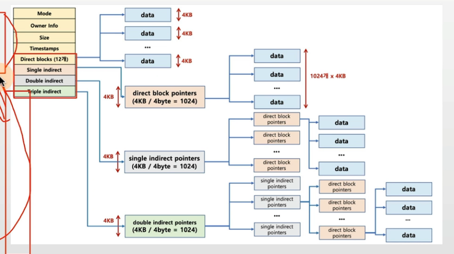

## 목차
1. [파일시스템](#파일-시스템)
2. [inode파일시스템](#inode-방식-파일-시스템)

## 파일 시스템
- 파일 시스템 : 운영체제가 파일을 쓰기 위한 자료구조 또는 알고리즘

### 본 챕터 목표
- 다음 단골 CS 지식 문항에 대해 구체적으로 이해하고, 답변 준비하기

1. inode 파일 시스템 방식에 대해 간단히 설명해주세요.
2. 가상 머신에 대해 간단히 설명해주세요
3. 외부 단편화에 대해 간단히 설명해주세요

> 현업, IT 기술과 컴퓨터 공학이 어떻게 쓰이는지도 수시로 설명

### 가볍게 알아두기: 파일 시스템이 만들어진 이유(블록)
- 0과 1의 데이터를 어떻게 저장매체에 저장할까?
    - 비트로 관리하기에는 오버헤드가 너무 큼
    - 블록 단위로 관리하기로 함 (보통 4KB)
    - 블록마다 고유 번호를 부여해서 관리.

- 사용자가 각 블록 고유번호를 관리하기 어려움
    - 추상적(논리적) 객체 필요: 파일

- 사용자는 파일단위로 관리
    - 각 파일에는 블록 단위로 관리

### 가볍게 알아두기: 파일 시스템이 만들어진 이유(저장방법)
- 저장매체에 효율적으로 파일을 저장하는 방법
    - 가능한 연속적인 공간에 파일을 저장하는 것이 좋음
    - 외부 단편화, 파일 사이즈 변경 문제로 불연속 공간에 파일 저장 기능 지원 필요
        - 블록 체인: 블록을 링크드 리스트로 연결
            - 끝에 있는 블록을 찾으려면, 맨 처음 블록부터 주소를 따라가야 함
        - 인덱스 블록 기법: 각 블록에 대한 위치 정보를 기록해서, 한번에 끝 블록을 찾아갈 수 있도록 함

### 현업, IT 기술과 컴퓨터공학의 이해
- 외부 단편화와 링크드 리스트 자료구조

> 참고: 링크드 리스트

### 가볍게 알아두기: 다양한 파일 시스템
- Windows: FAT, FAT32, NTFS
    - 블록 위치를 FAT라는 자료구조에 기록
- 리눅스(UNIX 계열): ext2, ext3, ext4
    - 일종의 인덱스 블록 기법인 inode 방식 사용

> 가장 기본이 되는 파일 시스템 방식은 inode 방식

### 현업, IT 기술과 컴퓨터공학의 이해

- 파일 시스템과 파일 관련 함수 및 시스템 콜
    - 동일한 시스템콜을 사용해서 다양한 파일 시스템 지원 가능토록 구현

    - read/write 시스템 콜 호출시, 각 기기 및 파일 시스템에 따라 실질적인 처리를 담당하는 함수를 호출하는 방식으로 내부 구현됨 (예: read_spec/write_spec)

    - 운영체제가 제공하는 시스템 콜을 기반으로, 각 언어에서 해당 시스템콜을 호출하도록 라이브러리등을 제공함

## inode 방식 파일 시스템
- 파일 시스템 기본 구조
    - 수퍼 블록: 파일 시스템 정보
    - 아이노드 블록: 파일 상세 정보
    - 데이터 블록: 실제 데이터

### inode 방식 파일 시스템(수퍼 블록)
- 수퍼 블록: 파일 시스템 정보 및 파티션 정보 포함

### inode와 파일
- 파일 inode 고유값과 자료구조에 의해 주요 정보 관리
    - `파일이름:inode`로 파일이름은 inode 번호와 매칭
    - 파일 시스템에서는 inode를 기반으로 파일 엑세스
    - inode 기반 메타 데이터 저장

### inode 구조
- inode 기반 메타 데이터(파일 권한, 소유자 정보, 파일 사이즈, 생성시간등 시간 관련 정보 데이터 저장 위치등)

### inode 구조와 파일

### inode 구조와 파일 데이터

### 디렉토리 엔트리
- 리눅스 파일 탐색: 예 - /home/ubuntu/link.txt
    - i. 각 디렉토리 엔트리(dentry)를 탐색
        - 각 엔트리는 해당 디렉토리 파일/디렉토리 정보를 가지고 있음.
    - ii. `/` dentry에서 `home`을 찾고, `home`에서 `ubuntu`를 찾고 `ubuntu`에서 link.txt 파일 이름에 해당하는 inode를 얻음

### 가상 파일 시스템(Virtual File System)
- Network등 다양한 기기도 동일한 파일 시스템 인터페이스를 통해 관리 가능
- 예: read/write 시스템콜 사용, 각 기기별 read_spec/write_spec 코드 구현 (운영체제 내부)

### 참고: 리눅스(유닉스) 운영체제와 가상 파일 시스템

- 모든 것은 파일이라는 철학을 따름
    - 모든 인터렉션은 파일을 읽고, 쓰는 것처럼 이루어져 있음
    - 마우스, 키보드와 같은 모든 디바이스 관련된 기술도 파일과 같이 다루어짐
    - 모든 자원에 대한 추상화 인터페이스로 파일 인터페이스를 활용

### 참고: 특수 파일
- 디바이스
    - 블록 디바이스(Block Device)
    : HDD, CD/DVD와 같이 블록 또는 섹터 등 정해진 단위로 데이터 전송, IO 송수신 속도가 높음
    - 캐릭터 디바이스(Character Device)
    : 키보드, 마우스 등 byte 단위 데이터 전송, IO 송수신 속도가 낮음
    - cd /dev, catty

