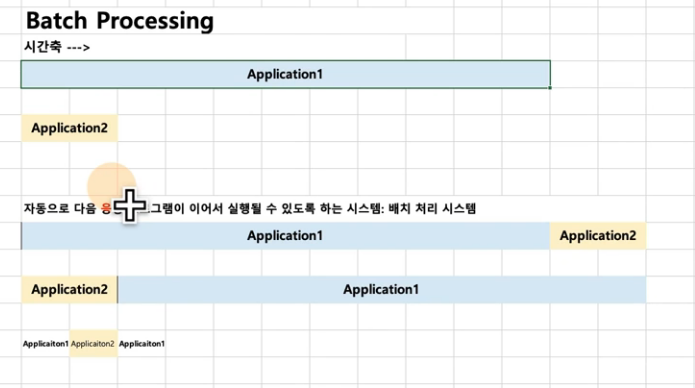
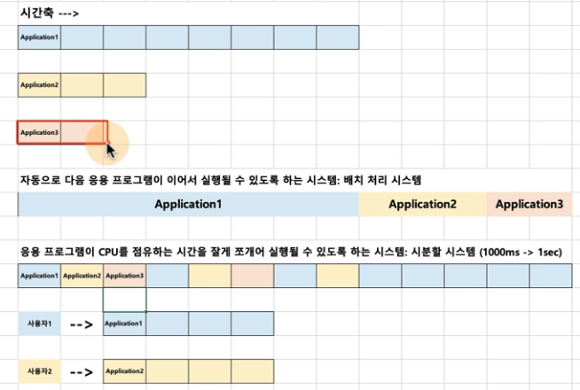
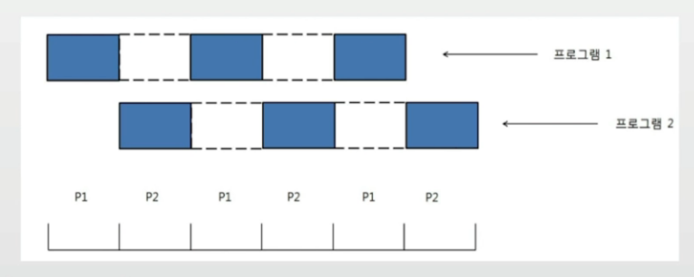
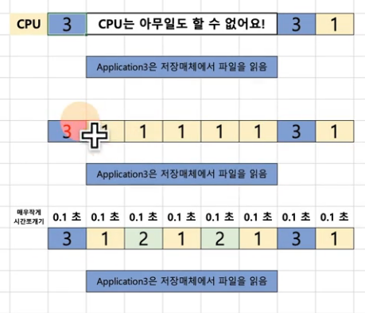

## 프로세스(process)

- 실행 중인 프로그램은 프로세스라고 함
    - 프로세스: 메모리에 올려져서, 실행 중인 프로그램
    - 코드 이미지(바이너리): 실행 파일
- 응용 프로그램 != 프로세스
    - 응용 프로그램은 여러 프로세스로 구성 가능

> 프로세스라는 용어는 작업, task, job 이라는 용어와 혼용
> 
> [프로세스](https://www.fun-coding.org/linux_basic2.html)

### 배치 처리 시스템
- 여러 프로그램을 순차적으로 실행시킬 수 있도록 해줍니다.
    - 어떤 프로그램은 실행이 너무 시간이 많이 걸려서, 다른 프로그램이 실행하는데 시간을 많이 기다려야 한다.

- 자동으로 다음 응용 프로그램이 이어서 실행될 수 있도록 실행해야되는 프로세스를 미리 등록한다.
> 참고: Batch Processing[OS]

### 시분할 시스템
- 시분할 시스템: 다중 사용자 지원을 위해 컴퓨터 응답 시간을 최소화하는 시스템
    - 여러 사용자가 동시에 하나의 컴퓨터를 쓰려면 어떻게 해야 하는가? (다중 사용자 지원)

> 참고: Time Sharing[OS]

### 멀티 태스킹
- 멀티 태스킹: 단일 CPU에서, 여러 응용 프로그램이 동시에 실행되는 것처럼 보이도록 하는 시스템
    - 나는 MP3 음악을 들으며, 문서 작성을 한다.

- 10 - 20 ms 단위로도 실행 응용 프로그램이 바뀜

> 1000 밀리초(ms) = 1초

### 멀티 프로그래밍
- 최대한 CPU를 많이 활용하도록 하는 시스템
    - 응용 프로그램은 CPU와 다양한 하드웨어 사용 (파일 읽기)

> 참고: Multi Programming[OS]

### 메모리 계층 - 컴퓨터 구조 이해
> 어떤 데이터에 접근하는데 있어서 CPU 계층에서 멀어질 수록 시간이 오래 걸린다.

### 멀티 프로그래밍과 Wait
- 멀티 프로그래밍: CPU 활용도를 극대화 하는 스케쥴링 알고리즘
- Wait: 간단히 저장매체로부터 파일 읽기를 기다리는 시간으로 가정

### 멀티 태스킹과 멀티 프로세싱
- 멀티 태스킹과 멀티 프로세싱

- 멀티 태스킹: 단일 CPU
- 멀티 프로세싱: 여러 CPU에 하나의 프로그램을 병렬로 실행해서 실행속도를 극대화시키는 시스템

### 현업, IT 기술과 컴퓨터공학의 이해
- 프로그램 성능을 높이는 방법
    - 가능한 메모리상에서 실행하도록 해야 함
    - 예: Redis, Scala

### 정리
- 시분할 시스템: 다중 사용자 지원, 컴퓨터 응답시간을 최소화하는 시스템
- 멀티 태스킹: 단일 CPU에서 여러 응용 프로그램을 동시에 실행하는 것처럼 보이게 하는 시스템
- 멀티 프로그래밍: 최대한 CPU를 일정 시간당 많이 활용하는 시스템
- 멀티 프로세싱: 여러 CPU에서 하나의 응용 프로그램을 병렬로 실행해서, 실행속도를 높이는 기법