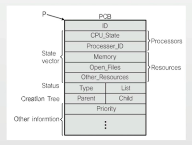

## 목차
- [프로세스](#프로세스process)
- [스케쥴링](#스케쥴링)
- [프로세스 구조](#프로세스구조)
- [힙과 컨텍스트](#힙과-컨텍스트)
- [멀티프로세스 IPC](#멀티프로세스와-ipc)
- [운영체제와 프로세스동작](#운영체제와-프로세스-동작-정리)
## 프로세스(process)

- 실행 중인 프로그램은 프로세스라고 함
    - 프로세스: 메모리에 올려져서, 실행 중인 프로그램
    - 코드 이미지(바이너리): 실행 파일
- 응용 프로그램 != 프로세스
    - 응용 프로그램은 여러 프로세스로 구성 가능

> 프로세스라는 용어는 작업, task, job 이라는 용어와 혼용
> 
> [프로세스](https://www.fun-coding.org/linux_basic2.html)

### 배치 처리 시스템
- 여러 프로그램을 순차적으로 실행시킬 수 있도록 해줍니다.
    - 어떤 프로그램은 실행이 너무 시간이 많이 걸려서, 다른 프로그램이 실행하는데 시간을 많이 기다려야 한다.

- 자동으로 다음 응용 프로그램이 이어서 실행될 수 있도록 실행해야되는 프로세스를 미리 등록한다.
> 참고: Batch Processing[OS]


### 시분할 시스템
- 시분할 시스템: 다중 사용자 지원을 위해 컴퓨터 응답 시간을 최소화하는 시스템
    - 여러 사용자가 동시에 하나의 컴퓨터를 쓰려면 어떻게 해야 하는가? (다중 사용자 지원)

> 참고: Time Sharing[OS]


### 멀티 태스킹
- 멀티 태스킹: 단일 CPU에서, 여러 응용 프로그램이 동시에 실행되는 것처럼 보이도록 하는 시스템
    - 나는 MP3 음악을 들으며, 문서 작성을 한다.

- 10 - 20 ms 단위로도 실행 응용 프로그램이 바뀜


> 1000 밀리초(ms) = 1초

### 멀티 프로그래밍
- 최대한 CPU를 많이 활용하도록 하는 시스템
    - 응용 프로그램은 CPU와 다양한 하드웨어 사용 (파일 읽기)

> 참고: Multi Programming[OS]


### 메모리 계층 - 컴퓨터 구조 이해
> 어떤 데이터에 접근하는데 있어서 CPU 계층에서 멀어질 수록 시간이 오래 걸린다.


### 멀티 프로그래밍과 Wait
- 멀티 프로그래밍: CPU 활용도를 극대화 하는 스케쥴링 알고리즘
- Wait: 간단히 저장매체로부터 파일 읽기를 기다리는 시간으로 가정


### 멀티 태스킹과 멀티 프로세싱
- 멀티 태스킹과 멀티 프로세싱


- 멀티 태스킹: 단일 CPU
- 멀티 프로세싱: 여러 CPU에 하나의 프로그램을 병렬로 실행해서 실행속도를 극대화시키는 시스템

### 현업, IT 기술과 컴퓨터공학의 이해
- 프로그램 성능을 높이는 방법
    - 가능한 메모리상에서 실행하도록 해야 함
    - 예: Redis, Scala

### 정리
- 시분할 시스템: 다중 사용자 지원, 컴퓨터 응답시간을 최소화하는 시스템
- 멀티 태스킹: 단일 CPU에서 여러 응용 프로그램을 동시에 실행하는 것처럼 보이게 하는 시스템
- 멀티 프로그래밍: 최대한 CPU를 일정 시간당 많이 활용하는 시스템
- 멀티 프로세싱: 여러 CPU에서 하나의 응용 프로그램을 병렬로 실행해서, 실행속도를 높이는 기법

## 스케쥴링

### 스케쥴러와 프로세스
> 프로세스 실행을 누가 관리하는가? - 스케쥴러

### 스케쥴링 알고리즘
> 어느 순서대로 프로세스를 실행시키는가?
- 목표
    - 시분할 시스템 예: 프로세스 응답 시간을 가능한 짧게
    - 멀티 프로그래밍 예: CPU 활용도를 최대로 높혀서, 프로세스를 빨리 실행

### FIFO 스케쥴러
> 프로세스가 저장매체를 읽는 다든지, 프린팅을 한다든지 하는 작업 없이, 쭉 CPU를 처음부터 끝까지 사용

- 가장 간단한 스케쥴러 (배치 처리 시스템)
- FCFS (First Come First Served) 스케쥴러


- FIFO는 어디서 배웠는가?..


- [스택&큐](http://www.stoimen.com/2017/09/14/data-structures-infographic-stack-queue/)

> 스케쥴러에 스택 구조를 사용하면 어떻게 동작하는가??

### 최단 작업 우선(SJF) 스케쥴러
- SJF(Shortest Job First) 스케쥴러
    - 가장 프로세스 실행시간이 짧은 프로세스부터 먼저 실행을 시키는 알고리즘

### 현업, IT 기술과 컴퓨터공학의 이해
- SJF 스케쥴러도 실제로 좋은 개발자답게 작성한다면?
    - 자료구조와 알고리즘에 익숙한 상태라면, 좋은 개발자는 분명히 최소한 우선순위 큐와 힙 자료구조 사용을 고려할 것임 (시간복잡도가 O(nlogn)임)
    - 스케쥴러는 운영체제 핵심기능으로 빈번하게 호출되므로, 스케쥴러 알고리즘은 운영체제 성능에 큰 영향을 미침

> 왜 자료구조와 알고리즘이 필요한지, 코딩테스트를 왜 보는지 이해할 수 있음

- RealTime OS(RTOS): 응용 프로그램 실시간 성능 보장을 목표로 하는 OS
    - 정확하게 프로그램 시작, 완료 시간을 보장
    - Hardware RTOS, Software RTOS
- General Purpose OS(GPOS):
    - 프로세스 실행시간에 민감하지 않고, 일반적인 목적으로 사용되는 OS, 예: Windows, Linux 등

- 랙?: 마우스 / 키보드 반응이 느린 경우?

> 스케쥴러가 해결해야 하는 이슈!
>
> 다양하고 복잡한 스케쥴링 알고리즘 필요

- 최근 리눅스 스케쥴러: O(1)와 같이 보다 효율적인 알고리즘을 사용 중

- 현업 프로그램은 성능에 민감함
    - 대용량 서비스

- 성능을 위해 꼭 체크해야 하는 포인트
    - 당신의 프로그램이 IO-bound 냐, CPU-bound 냐
        - IO-bound : IO 관련 기능이 주로 사용하는 프로그램
        - CPU-bound : CPU / 메모리를 주로 사용하는 프로그램

> 수시로 파일등을 접근한다면, 한번에 데이터를 메모리에 올려놓고 메모리를 접근하도록 만드세요!

### 우선순위 기반 스케쥴러
- Priority-Based 스케쥴러
    - 정적 우선순위
        - 프로세스마다 우선순위를 미리 지정
    - 동적 우선순위
        - 스케쥴러가 상황에 따라 우선순위를 동적으로 변경

### 스케쥴링 알고리즘
> 어느 순서대로 프로세스를 실행시킬까?
- 목표
    - 시분할 시스템 예: 프로세스 응답 시간을 가능한 짧게
    - 멀티 프로그래밍 예: CPU 활용도를 최대로 높혀서, 프로세스를 빨리 실행

### Round Robin 스케쥴러


> 현업, IT 기술과 컴퓨터공학의 이해
>
> 자료구조 큐를 사용하면 구현이 가능함.

### 프로세스 상태 기반 스케쥴러
> FIFO, Round Robin과 함께 기본적인 현대 스케쥴링 알고리즘 이해해보기


- running state: 현재 CPU에서 실행 상태
- ready state: CPU에서 실행 가능 상태(실행 대기 상태)
- block state: 특정 이벤트 발생 대기 상태(예: 프린팅이 다 되었다!)

### 정리
- 다양한 기본 스케쥴링 알고리즘
    - FIFO (FCFS) 스케쥴링 알고리즘 (배치 처리 시스템)
    - 최단 작업 우선(SJF) 스케쥴링 알고리즘
    - 우선순위 기반 스케쥴링 알고리즘
        - 정적 우선순위, 동적 우선순위
    - Round Robin 스케쥴링 알고리즘
        - 시분할 시스템
    - 프로세스 상태 기반 스케쥴링 알고리즘
        - 멀티 프로그래밍

## 프로세스 구조
- 프로세스 (process)는 일반적으로 어떻게 구성되어 있을까?
    - text(CODE): 코드
    - data: 변수 / 초기화된 데이터
    - stack: 임시 데이터(함수 호출, 로컬 변수등)
    - heap: 코드에서 동적으로 만들어지는 데이터


### 현업, IT 기술과 컴퓨터공학 이해
- 프로세스와 컴퓨터 구조
    - PC(Program Counter) + SP(Stack Pointer)
        - PC: 다음 실행할 코드 주소
        - SP: 스택 최상단 주소
    - 임베디드 시스템등에서 동작하는 C 프로그램등은 디버깅시 PC와 SP를 캡쳐해서 확인

> 참고: ProcessStructure[OS]


> 동작 순서
>
> 1. 0002h => (code) c = 0 => (data) c = 0
>
> 2. (code) c = func(1, 2) => func() (address : 0003h)
>
> 3. func(1, 2) => Stack => a = 1, b =2 => return a + b => 리턴 시 스택에 담겨있는 변수들을 차례로 삭제하고, 리턴 주소도 삭제.
>
> 4. c = func(1,2) result(3) => c = 3 
>
> 5. (DATA) c = 3
>
> 6. print(c)

## 힙과 컨텍스트

### Heap 이란?
```C
#include <stdio.h>
#include <stdlib.h>

int main()
{
    int *data;
    data = (int *) malloc(sizeof(int));
    *data = 1;
    printf("%d\n", *data);

    return 0;
}
```

### 현업, IT 기술과 컴퓨터공학의 이해
- JAVA GC와 프로세스 힙
    - JAVA GC가 필요한 이유
        - 불필요한 객체가 차지하는 힙 공간을 삭제하여, 힙 공간 확보가 필요하기 때문
        - 만약 힙 공간이 부족하면? 객체 생성이 불가하고, JAVA와 같은 객체지향 프로그램은 동작하지 않게 됨.

### 컨텍스트 스위칭
- Context Switching, 커텍스트 스위칭, 또는 문맥 교환
    - CPU에 실행할 프로세스를 교체하는 기술

- PC, SP만 바꿔주면, 프로세스 저장상태를 기반으로 실행 가능
> 참고: ProcessStructure[OS]

### Process Control Block (PCB)
- PCB에 다음 프로세스 정보 저장
    - Porcess ID, Register (PC, SP등) 등



> PCB: 프로세스가 실행중인 상태를 캡쳐/ 구조화해서 저장

### 컨텍스트 스위칭 세부 동작
1. 실행 중지할 프로세스 정보를 해당 프로세스의 PCB에 업데이트해서, 메인 메모리에 저장
2. 다음 실행할 프로세스 정보를 메인 메모리에 있는 해당 PCB 정보(PC, SP)를 CPU의 레지스터에 넣고, 실행

> 컨텍스트 스위칭은 리눅스의 경우 어셈블리 언어로 작성되어 있다. 이유는 운영체제에서 자주 호출되기 때문에 속도면에서 효율성을 얻기 위함.


### 현업, IT 기술과 컴퓨터 공학의 이해
- 윈도우/맥등의 태스크 매니저에서 PID 찾아보기
- 리눅스등에서 프로세스를 제어하는 명령은 PID를 기반으로 사용
    - 예: kill -9 PID

## 멀티프로세스와 IPC

### 프로세스간 커뮤니케이션(InterProcess Communication)
- 프로세스는 다른 프로세스의 공간을 접근할 수 없다.


### 프로세스간 통신이 필요한가?
- 성능을 높이기 위해 여러 프로세스를 만들어서 동시 실행
- 이 때 프로세스간 상태 확인 및 데이터 송수신이 필요

### IPC (InterProcess Communication)
> 프로세스간에 커뮤니케이션을 해야한다면 어떻게 해야할까?

- 프로세스간 통신 방법을 제공함
- IPC: InterProcess Communication

> 참고: IPC - file[OS]

### 실제 프로세스: 리눅스 예
- 커널 공간은 공유한다.
- 어떤 프로세스나 0 - 4GB 까지의 메모리 주소를 가짐

> 보다 구체적인 내용은 가상 메모리에서 다룸


### 다양한 IPC 기법

- IPC : InterProcess Communication

1. file 사용
2. Message Queue
3. Shared Memory
4. Pipe
5. Signal
6. Semaphore
7. Socket

> 2번부터는 모두 커널 공간을 사용하는 것 - 이것이 핵심

### 예: 공유 메모리 (shared memory)
- kernel space에 메모리 공간을 만들고, 해당 공간을 변수처럼 쓰는 방식


### 현업, IT 기술과 컴퓨터공학의 이해
- C 언어를 익혀야 하는 이유
    - JAVA, python 등은 사용자가 더 쉽게 개발할 수 있도록 만든 언어
    - 그만큼 컴퓨터 동작 이해가 부족해도 프로그램 구현이 가능
    - 현업에서도 C++ 등 언어를 사용하는 경우가 많음

> C 언어를 익혀서, 프로그래밍을 하려면, IPC 함수, 메모리 직접 제어 기능등을 이해하고 사용해야 하므로, C 언어를 모르는 개발자와는 더 깊은 레벨의 이해가 가능함.

### 정리
- 여러 프로세스 동시 실행을 통한 성능 개선, 복잡한 프로그램을 위해 프로세스간 통신 필요
- 프로세스간 공간이 분리되어 있음
- 프로세스간 통신을 위한 특별한 기법 필요
    - IPC (InterProcess Communication)
- 대부분의 IPC 기법은 결국 커널 공간을 활용하는 것임
    - 이유: 커널 공간은 공유하기 때문

## 운영체제와 프로세스 동작 정리


### 프로세스 구조에 대해 가능한 상세하게 설명

### 컨텍스트 스위칭에 대해 가능한 상세하게 설명

### 프로세스간에는 어떻게 통신하는지 가능한 상세하게 설명
