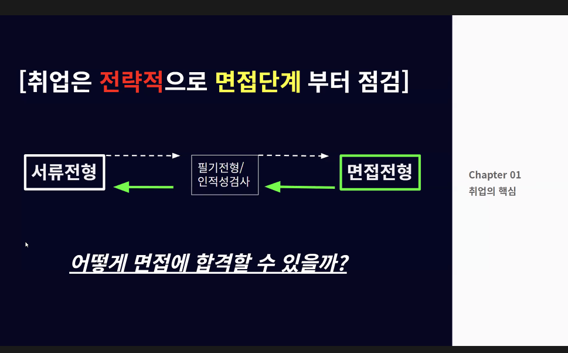
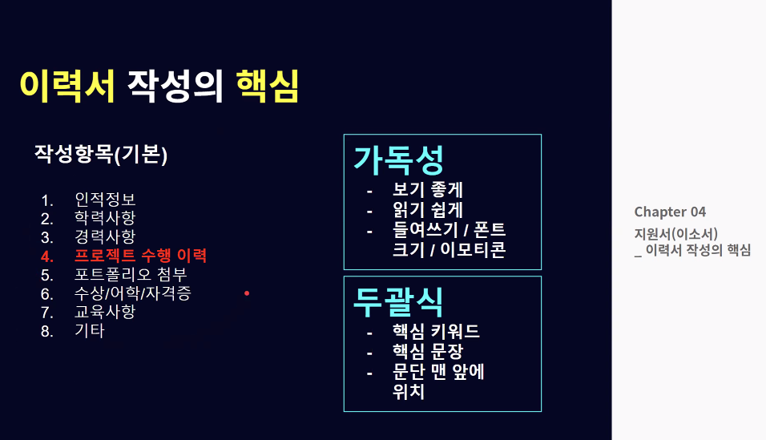

zero-base

### 커리어 코칭

### 지피지기

### 취업은 면접 단계부터 점검

### 면접관은 무엇을 평가하는가

## 직무 전문성

1. 생각을 구현하는 것이 흥미를 얻었고,
교육에 대한 컴플렉스가 제 안에 존재했고 역설적으로 교육에 대한 관심과 욕구가 생겼습니다.

2. github 블로그

3. 포트폴리오
=> 
4. 

5. 왜 우리회사인가? (지원 동기)
=> 교육에 대한 컴플렉스를 평소 가지고 있었고, 
교육에 대한 이해에 관해서 많이 생각했습니다.
현재 교육 상황에서 해당 회사가 가지고 있는 비전에
저의 비전이 부합한다고 생각 했고 그로 인해 지원하게 되었습니다.

## 산업/기업/직무 분석

## 커리어 목표 설정

## 포트폴리오

### 포트폴리오가 중요한가

### 프로젝트 작성법

## 지원서(이소서)

## 채용공고 파헤치기

## 이력서 작성의 핵심

## 지원서 작성 사례

## 자소서 작성의 핵심

## 면접의 핵심

## 면접 답변의 핵심

## 면접 불합격 3요소

## 마무리

