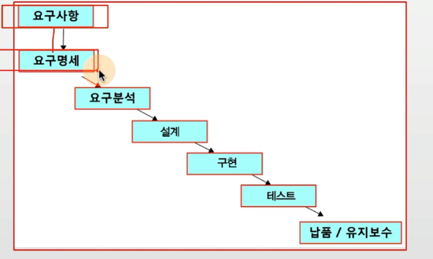

## 목차
- [소프트웨어 공학](#소프트웨어-공학)
- [설계 단계](#design-설계)
- [구현 단계](#implementation-구현)
- [개발 방법론](#개발-방법론)
- [애자일](#agile)

## 소프트웨어 공학
- 기존 소프트웨어 공학에서 다룬 이론은 이론일뿐더러, 최신 현업 프로세스와 다름
- 전통적인 SI 업계의 프로세스는 최신 현업 IT 프로세스와는 다름

> 본래 소프트웨어 공학은 : 망하지 않고, 제대로 계획된대로 일정안에 만들기
>
> 최신(현업) 소프트웨어 공학은 어떻게 숨은 needs에 맞는 소프트웨어를 빠르게 만들 수 있을까.

### 소프트웨어 개발 프로세스
> 일반적인 단계를 이해하고, 전통적인 개발 방법론에 대해 이해.

### 소프트웨어 공학이 타 공학과 다른점
1. 소프트웨어는 무형
2. 개발 품질 평가 어려움

### 소프트웨어 위기
1. 개발과 요구사항이 다른 경우가 발생
2. 개발 일정 지연, 추가 비용 필요등 불안요소 존재

> 많은 초기 스타트업이 출시를 못하고 망함.

### 소프트웨어 프로세스 정형화
1. SI(System Integration) 업계에서는 적합
    - 배만드는 작업과 유사
2. 첨단 소프트웨어 개발에는 괴리가 큼
> 하지만, 기본적이고, 일반적인 단계에 대해서는 알아둘 필요가 있음.

### 전통적인 소프트웨어 프로세스 정형화
- 소프트웨어 개발 관련자
    - 요청 고객 (Client)
    - 사용자 (실제 Customer)
    - 프로젝트 관리자 (PM)
    - 개발자 (Developer)

> SI는 발주처가 존재, 실제 사용자가 있고, 이를 받아서 PM이 프로젝트를 관리하고, 개발자가 개발을 한다.

### Software Development Life Cycle

### Business Requirements (요구 사항)
> Customer Pain points(WHY) + Scope + Benefit
- 예) 쇼핑몰

1. (Pain point) 고객이 상품을 찾을 수 없어서 구매를 못하고 있다.
2. (Scope) 전체 상품 검색
3. (Benefit) 고객 경험을 증대시키고, 궁극적으로 매출 향상

### Business Requirements (요구 사항 + 요구 분석)
> 실제 구현하려면 매우 상세한 기능 분석 필요
> 
> 이 기능이 원하는 기능이 맞는지 명확히 도장을 찍을 필요가 있음
- 예) 쇼핑몰
- 쇼핑몰 상단에 검색창 제공
    - 상품 타이틀, 상품 제공자 검색 기능 제공
    - 상품 타이틀, 상품 제공자, 전채 검색 옵션 제공
    - 검색 시간은 1초 내외 응답시간 유지

> 어떻게 상세하게 만들고 고객 컨펌을 받을까?
- 요구사항 유도 : 요청자와의 토의를 통해 요구사항 구체화
- 요구사항 분석 : 요구사항 상세화해서 명확하게 만드는 작업
- 요구사항 기록 : 요구사항을 문서화해서 요청자와 도장 찍기.

> 요구사항을 더 깊게 세분화하면 항목별로 세분화 가능.
1. Functional Reqs(기능 레벨)
2. System Reqs(필요 시스템)
3. Quality Reqs(테스트 요구사항)
4. External Reqs(외부 시스템과의 연결 요구사항)
5. Constraints(제약 사항)

## Design (설계)
> 세부적으로 구현 레벨로 설계한다
>
> 절차지향과 객체지향으로 나뉨

### Design(설계) - 구조도(절차지향)
- 주요 데이터를 표기하기도 함

### Design(설계) - 협력도(절차지향)

### Design(설계) - UseCase Diagram(객체지향)
- Actor가 사용하는 Case를 구체화함.

### Design(설계) - Class Diagram(객체지향)
- Class를 정의하고, Class 간의 관계를 구체화함(속성, 메서드레벨)

### Design(설계) - Sequence Diagram(객체지향)
- 각 Class간 호출 관계 표시

## Implementation (구현)
> Project Management 로 각 구현, 테스트단계 세분화
>
> 요구사항분석부터 출시까지 전체 관리하기도함

> 주로 MS Project로 사용

### Implementation (테스트)
> QA라고 이야기함
>
> 소프트웨어 버그 확인

### Release (납품?)
> 소프트웨어 릴리즈는 테스트단계에서 완벽한 버전을 수차례 확인해서 공식 릴리즈하게 됨
- Pre-alpha: 핵심 기능이 동작하기 시작한 상태
- Alpha: 소프트웨어 테스트 단계
- Beta: 외부에 테스트 단계로 명시해서 오픈해서 내외부 테스트 단계
- RC(Release Candidate): 정식 Release 후보
- Official Release: 고객이 사용하는 완벽한 버전

### Maintenance (유지보수)
> 납품 후 운영에 많은 비용이 듬
>
> 프로그램 유지보수, 추가 요구사항 반영등
- 전체 개발: 개발(70%) + 유지보수(30%)

### Software Development Life Cycle
> 쇼핑몰 만들어주세요!

## 개발 방법론

### 개발 방법론 - 프로세스
- 폭포수 모델(Waterfall model)
    - 배만드는데에 적합
    - 소프트웨어???

- 완벽하게 설계해서, 완벽하게 개발자 #명, 기간까지 예측

### 개발 방법론 - 폭포수 모델(Waterfall model)
- 개발 일정은 항상 늦어짐
    - 개발자는 끝없는 야근
    - 일정을 아예 더 줄이니까, 개발자가 야근을 해서 결국 개발 기간은 줄어들었다.

- 개발 1년걸려 다했는데
    - 고객이 그동안 상황이 변해서 추가 요구사항을 냄
    - 또 야근

### 개발 방법론 - 프로토 타입 모델

### 개발 방법론 - 나선형 모델(Spiral model)
- 개발시 위험을 최소화하기 위해 점진적으로 완벽한 프로그램을 개발해나가는 모델
- 리스트 최소화를 위해 위험 분석 단계 존재
- 점진적으로 단계를 반복 수행

### 최신 소프트웨어 업계(미국 + 스타트업 중심)
- 서비스 개발 증가 (Mobile First)
    - 모든 서비스는 모바일 포함
    - 웹 + 모바일 형태로 서비스 개발
    - 클라우트 컴퓨팅 기반
    - 개인정보 보호 강화
- 새로운 기술을 빠르게 서비스화
    - 개발자는 새로운 기술을 빠르게 익히고, 바로 서비스에 적용
    - 최소 기능 레벨로 빠르게 개발, 적용, 경험 후 변경
    - 기능 개발시 AB Test등 고객 반응 확인 후, 고객 반응 좋은 기능 중심 출시

- Fast iterable experiments with micro features
    - New Technologies
    - Micro features
    - Customer Experience Monitoring
        - ABTests with micro features
        - Big Customer Logs
    - Increase the efficiency with technologies

## Agile

### 최근 소프트웨어 업계(미국+스타트업 중심)
- Fast iterable experiments with micro features
    - 개발 방법론: Agile
- Increase the efficiency with technologies
    - 유지보수 + 운영 자동화: DevOps

### Agile
- 전통적인 한국 회사

### 기존 IT 회사
- 영업팀: 고객이 빨리 상품 좀 찾게 해달라 ~, 파는 상품을 못찾는 것 같다.(기획팀 수차례 압박, 사장님 동원)
- 기획팀: 쇼핑몰에 검색 기능 넣으면 매출이 늘 것 같다.(기획안 확정 2개월, 기획팀장 승인)
- 개발팀: 검색 기능 설계 완려(개발팀장 승인, 6개월내 개발 확정)
- 검색 기능 개발, 하지만 영업팀왈 상품 판매자 검색도 되게 해줘야함.

> 고객은 이미 검색 기능이 없어서 다른 쇼핑몰로 이동.

### Agile
- Product Owner
    - 영업팀과 이야기하고 분석해보니 검색 기능이 필요할 것 같으니 이번 달에 기능 추가.
- 개발팀 + UX 디자이너
    - 일단 검색 기능을 만들테니 한달 동안 우선 가장 최소 기능만 만듬.
- 최소 기능 개발 후, 고객 반응 보니 검색 기능에 상품 판매자 검색 기능도 넣어줘야 함.
- 개발팀 + UX 디자이너
    - 이번달에 해당 기능을 넣어줌.
> 고객의 빠른 요구 변화에 빠르게 대응.

### Agile 선언문
> 소프트웨어를 개발하고, 또 다른 사람의 개발을 도와주면서 소프트웨어 개발의 더 나은 방법들을 찾아가고 있다.

- 이 작업을 통해 우리는 다음을 가치 있게 여기게 되었다.
- 공정과 도구보다 개인과 상호작용을
- 포괄적인 문서보다 작동하는 소프트웨어를
- 계약 협상보다 고객과의 협력을
- 계획을 따르기보다 변화에 대응하기를
- 위는, 왼쪽에 있는 것들도 가치가 있지만, 우리는 오른쪽에 있는 것들에 더 높은 가치를 둔다는 것.

### Agile = 빠르고 쉽게!
- 변화에 대한 효과적인 (신속하고 적응적인) 대응
- 모든 이해관계자 간의 효과적인 의사소통
- 팀에 고객을 포함
    - 고객의 역할은 요구사항 제공, 우선 순위 부여, 평가하는데 중요
- 수행하는 작업을 제어할 수 있도록 팀 구성
    - 프로세스보다 사람

### Agile
1. Scrum Team 구성, (10명)
- Product Owner(Manager)
- Scrum Master
- Senior Developmment Manager
- Developer
- UX Designer
2. Sprint 만들어 계획세우고(1달, 또는 2주등)
3. Daily Scrum으로 매일같이 진척/변경사항 확인/공유하고
4. Sprint 끝나면 그동안 진행한 것 리뷰하고, 반성
> 2 - 4 과정을 반복

### Scrum
- an iterative and incremental agile software development framework for managing product development

### Scrim 팀 구성
- The product owner represents the stakeholders and is the voice of the customer, who is accountable for ensuring that the team delivers value to the business
- The development team is responsible for delivering potentially shippable increments (PSIs) of product at the end of each sprint (the sprint goal).
- facilitated by as scrum master, who is accountable for removing impediments to the ability of the team to deliver the product goals and deliverables.

### Sprint (계획 + 개발 + 회고)

> Epic(Stroy) -> Tickets(backlogs) -> Pritorization + Dev Estimation -> Dev -> Test -> Review

### Software Development Process
- UP(Unified Process)
    - 도입(분석위주), 상세(설계위주), 구축(구현위주), 이행(최종 릴리즈)의 반복
- XP(eXtreme Process)
    - 스크럼 마스터가 주도적으로 프로세스를 주도하며, 고객과 개발자 사이의 소통을 중시함
    - Product Owner와 Development Team, Customer로 롤을 구분하고 각자의 역할에 충실
    - TDD 중시

### TDD
- Test Driven Development
    - 객체지향적
    - 재설계 시간 단축
    - 디버깅 시간 단축
    - 애자일과의 시너지(사용자 중심적)
    - 테스트 문서 대체
    - 추가 구현 용이

### Continuous Integration(CI)
- 고객이 수시로 확인할 수 있도록 지속적으로 빌드 유지

> jenkins tool

- [JIRA 시스템 기반](https://www.atlassian.com/software/jira)

### 실제 Agile
- product owner
    - 고객을 직/간접 경험하고, 인터뷰해서 비지니스 요구사항 도출
    - 큰 개발건은 Product Requirement Document 작성해서 개발팀을 이해시킴
        - 고객에 우리 쇼핑몰에서 물건을 못찾는데
        - 검색 기능 넣어줘
        - 우선순위 정말 높아
    - 작은 건은 티켓을 만들어 개발보드에 backlog에 넣어놓음

- development team leader
    - 각 개발 사항을 작게 나눠서 티켓으로 만들고
    - 개발자에게 티켓을 assign
    - daily scrum으로 진행상황 확인
        - 개발자 progress 확인해야 진행이 되더라 (--;)
        - 본래는 수시 변경사항 공유와 의사소통을 위한 회의

- scrum master
    - 개발자들아 회의좀 하자!
    - 개발자들아 티켓 관리 좀 해라
    - 개발자들아 sprint 끝났다. 이건 왜 개발 안되었나. 반성할 건 무엇인가?
    - 세부적으로 더 논의해볼 사항은 별도 회의잡을테니 논의하자
    - 개발자들아 싸우지 말자..
> 다 그런것은 아니지만 하다보면 결국 이 방향으로 감..

- 한국 기업 문화에 젖어든 분들이 많으면 scrum master가 정말 중요한 역할을 해야 함
- 정말 서로 북돋는 분위기가 되어야 활발하게 돌아가고, 참신한 아이디어가 나옴

> agile은 결국 개발 문화다.

### DevOps
- 기존 서비스 조직
    - 개발팀
    - 운영팀

> 개발은 언제나 소통이 안됨

- micro feature release 하고 서비스 다운되면?
    - 이 서비스는 뭐하는거지?
    - 어떤 개발자가 잘못 release 했는가?.
    - 개발자의 문제.
    - release를 자주 하지 않는다.
    - 운영팀: 제대로된거 더 검수해서 release를 가능한 막는다.

> 고객은 빠른 신규 서비스 제공 필요.

- 모바일 시대에 고객이 빠르게 움직임
    - 빠르게 고객에게 서비스를 제공하지 않으면 다른 서비스로 바로 넘어간다.
    - micro features를 빠르게 개발하고 릴리즈

- 본래 새로운 기능 릴리즈하면 개발팀이 운영팀에 어떻게 운영할지 알려줘야 함
    - micro feature 라면 많은 기능을 제대로 알려주기 어렵고
    - 운영이 잘 안될 경우, 이 부분은 개발팀 역할이 아니므로 운영팀에 제대로 안알려주는 경우가 많음
- 수많은 micro features를 운영팀이 제대로 이해하고 대응하지 않으면?
    - 서비스 다운 또는 비정상 동작으로 고객 경험 극도로 저하.

- 수많은 micro features와 수많은 사용자
    - 엄청난 트래픽을 버텨낼 시스템과 운영팀 필요

- 개발자가 운영팀에 들어가면?
    - 운영효율적인 시스템 개발
    - 운영을 자동화시켜서 운영팀 인력 효율화 가능
    - 운영/개발 전체 이해/소통이 쉬움

> 그런데 아무도 안들어가려 함, 난 개발을 할꺼야!

- 운영 + 운영시스템 효율화/자동화 프로젝트를 목표로 부여!
    - 개발자가 목표를 가지고 개발을 할 수 있음(난 개발을 좋아해!)
    - 개발자는 micro features에 대해서도 빠르게 이해할 수 있음 (다양한 기술 습득 가능)

- Release System 자동화
- 코드 리뷰, 테스트 자동화
- 서비스 모니터링 시스템
- 이슈 발생시 커뮤니케이션 시스템
- 비즈니스가 가속화되니, (1) 빠른 기능 개발, (2) 엄청난 트래픽에 시스템 안정화 필요
- 운영팀이 빠른 각 기능 개발 이해하고, 빠른 릴리즈 가능케 해야하고, 이슈 있을 때 빠르게 대응하고, 시스템 안정화 필요함

> 결국, 운영팀에 개발자가 들어가서 일하게끔 목표를 부여한 것

> 완전 전문 분야가 되어가고 있음
>
> 서비스 운영에 꼭 필요한 팀
>
> Google: SRE(Site Reliability Engineering)

### Devops 정의
> used to refer to a set of practices that emphasizes the collaboration and communication of both software developers and other information-technology(IT) professionals while automating the process of software delivery and infrastructure changes.
>
> It aims at establishing a culture and environment where building, testing, and releasing software can happen rapidly, frequently, and more reliably.
>
> 결국 DevOps도 운영팀의 새로운 문화

### 스타트업 현업 case
> 세상을 혁신하려면 고객의 pain point를 이해하고, 새로운 기술을 고안해서 문제를 해결해야 함.

- 고객의 pain point를 찾는 방법
    - 직접 완벽하게 고객이 되어봐야 함
    - 안되면 고객 옆에서 최대한 관찰이라도 해야함.
> 고객의 pain point를 찾고, 이를 해결하는 WHY를 찾아야 함.

- 개발자의 창의성을 살리면서 혁신하는 방법?
    - 명확한 목표를 주고.
    - WHY 그런 목표를 세웠는지를 명확히 이해시키고
    - 목표가 완수되었을 때 어떤 결과가 있을지 이해시키고
    - 목표가 완수되었을 때 개발자가 얻을 혜택도 이해시키고
    - Daily Progress를 확인해라 (Agile)

> 결국 이 부분도 고객의 pain point 부터 시작한다.

- 린 스타트업
    - 승리할 수 있는 유일한 방법은 다른 누구보다 빨리배우는 것이다.

- 스타트업 이란?
    - 스타트업이란 극심한 불확실성 속에서 신규 제품이나 서비스를 만들려고 나온 조직

### 린 스타트업
- 제품 또는 서비스 개발 행위 : 학습
- 최소 기능만 가진 서비스/ 제품을 빠르게 런칭
    - 고객의 반응을 수치화한 데이터 기반으로 판단
        - AB 테스트
        - 서비스/제품 로그 기반 데이터 분석 (빅데이터)
    - 고객의 반응에 따라 서비스/제품 수정/개선 진행

> 짧은 주기로 빠르게 기능 개선/고객 반응 확인을 통해 최대한 빠르게 학습하고, 알맞은 서비스 개발하여 극심한 불확실성에 대응

### 현업과 컴퓨터공학의 이해
- 린 스타트업(AB Test 로그 기반 데이터분석)
- Agile(daily 개발 관리)
- DevOps(운영 개선 및 관리)
