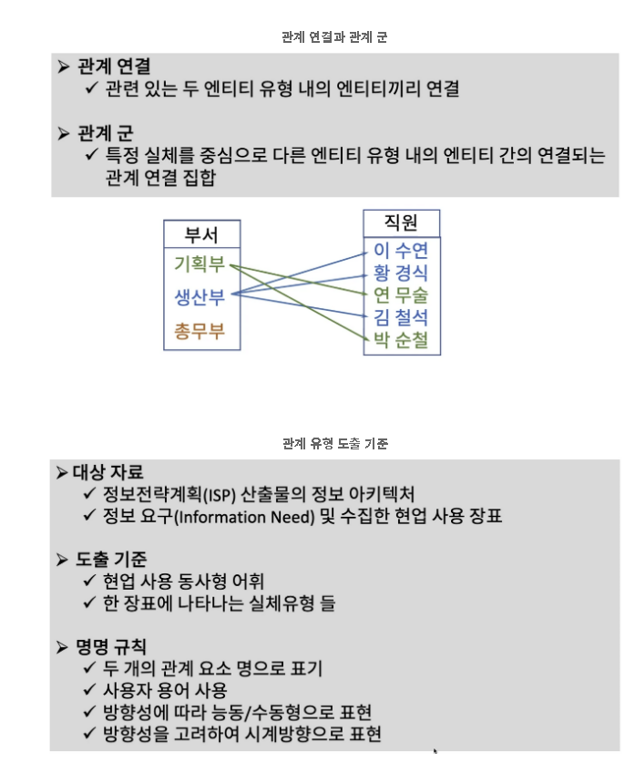

## 2. HTTP에 관한 설명

1. HTTP는 HyperText Transfer Protocol의 약자임.
2. HTTP의 주요 메소드로 GET, POST, PUT 등이 있음.
3. HTTP는 Stateless임.
4. HTTP는 통신이 끝나도 상태 정보를 유지하지 않음.

## 3. SSL/TLS에 관한 설명
- 정의 : SSL(Secure Socket Layer) / TLS(Transport Layer Security)

1. TCP/IP 네트워크 통신간 보안을 제공하는 프로토콜
2. Netscape라는 회사가 만든 SSL 1.0 -> SSL 2.0 -> SSL 3.0(1996)
3. IETF 국제기관에서 1999년 TLS 1.0 -> TLS 1.1 -> TLS 1.2(SHA2) -> TLS 1.3(2018년) - 확장 SNI 암호
4. HTTPS(Hypertext Transfer Protocol Secure) = HTTP over TLS(HTTP라는 프로토콜을 TLS로 한번 휘감아서 암호화시켜 보내겠다)

### 4. 엔터프라이즈 비즈니스 아키텍처 구조

- 전략(Strategy)는 기업이 목표를 달성하기 위하여 가용한 자월을 배치하는 수단 및 방법 정의
- 목표(Goal)은 기업의 장기적 관점에서 달성하기를 원하는 결과를 정의함.
- 사명(Mission)은 기업의 성격에 관한 일반적인 규명과 고객 및 제품에 대한 포지셔닝을 정의함.
- CSF : 기업이 전략을 성공적으로 수행하는데 영향을 주는 요소(촉진요소, 저해요소)
- KPI : 목표 대비 전략의 수행 정도를 보여주는 지표로써, 목표가 어느 정도 달성되었는가를 알려줌

### 5. 4 PMs

- 프로젝트 매니지먼트
- 프로세스 매니지먼트
- 프로덕트 매니지먼트
- 피플 매니지먼트

### 6. 주제영역(Subject Area)를 통한 엔티티 유형 도출 과정

- 엔티티 유형 (Entity Type)
    - 개체에 대한 의미 정의
    - 모든 개체 집합에 공통적 성격 정의 및 속성 관계를 적용

- 엔티티 (Entity)
    - 비즈니스 개체 각각에 대한 표현
    - 데이터로 관리되는 조직에 관련된 사항

- 기업이 자료로 저장, 관리하려는 대상으로 사람, 장소, 사건, 사물, 개념에 대한 범주(Category)

- 엔티티 유형 요건
    - 기업 비즈니스에 유용한 정보 요구(Information Needs)를 만족해야 함
- 정의된 속성 유형(자료 항목)이 해당 엔티티 유형의 성격을 설명하고, 식별자(Identifier)가 아닌 속성 유형이 하나 이상 존재해야 함
- 엔티티 유형에 각각 엔티티를 유일(Unique)하게 식별할 수 있는 식별자 속성 유형이 존재해야 함
- 적어도 다른 하나의 실체 유형과 연관 관계를 가져야 함
    - 실체 유형 간에 비즈니스적 연관 관계가 반드시 존재해야 함

### 7. CRUD의 의미
- CREATE
- READ
- UPDATE
- DELETE

### 8. CRUD Matrix

### 9. CRUD Matrix Clustering
- 친화도 분석 묶음화
    - Affinity(E1, E2) = $ \frac{Number of action using E1 \& E2}{Number of action using E1} $
- 가치 흐름 묶음화
    - 고객(또는 행위자(Actor))의 프로세스를 중심으로 교차 기능적(Cross functional)하게 업무기능을 묶음화
- 직관 묶음화
    - CRUD 매트릭스의 엔티티 유형에 대한 작용(Action) 중 생성
    - "C" (Create)를 중심으로 재배열 한 후 직관적으로 Clustering

### 10. 데이터베이스 관리 시스템(DBMS) 선정을 위한 고려 사항
- 운영체계 지원 : 현재 사용중인 조직내 운영체계(OS) 지원 여부
- 조직 유형 : 전통적 문화에 대한 적응력 등 평가
- 벤치마킹 : 트랜잭션 프로세싱 성능 카운슬(TPC) 성능 기준 벤치마킹
- 확장성 : 요구 사용자 수와 용량 확장에 대한 용이성 평가
- 소프트웨어 툴 지원 가능성 : 쿼리 분석, 백업 복구 툴 등 지원 툴
- 기술자 : DBA 등 기술 지원 및 어플리케이션 프로그래머 지원 능력
- 소유 비용 : 총 소유 비용(TCO)과 라이센스 비용과의 대비
- 릴리즈 일정 : 밴더의 새로운 릴리즈 주기 및 업그레이드 일정 평가
- 고객 레퍼런스 : 현재 사용하는 고객의 서비스 품질에 대한 의견 청취

### 11. 엔터프라이즈 정보 모델의 구성요소
- 프로세스 모델
    - 업무활동 모델링
        - 요구되는 업무활동 도출 및 정의
        - 업무활동을 업무기능과 프로세스로 분할하고 이벤트간 의존관계로 연결
        - 최종적으로 태스크와 프로그램으로 변환

- 데이터 모델
    - 기업 데이터 도출 및 정의
    - 관심 있는 대상이나 사건을 엔티티 유형 및 관계로 표현
    - 최종적으로 데이터베이스 구조로 변환됨

- 상호작용 모델링
    - 데이터 및 업무활동에 대한 상호작용성을 CRUD 매트릭스로 표현
    - 데이터 및 업무활동 모델에 대한 품질 점검
    - 묶음화(Clustering)를 통해 비즈니스 시스템 및 데이터베이스 정의

### 12. 객체 모델링
- 실 세계에서 발생하는 객체 특성과 구조를 그대로 표현
- 다양한 어플리케이션 분야에서 객체(데이터) 상태 변화를 명확히 표현
- 의미적 관계를 가지는 데이터 모델링을 통해 견고한 데이터베이스 구조 설계

### 13. 객체(Object) 모델링과 관련된 용어
- 응축(Encapsulation)
- 상속(inheritance)
- 클래스(Class)

### 14. Entity, Entity Type

### 15. 관계(Relationship), 관계 유형(Relationship Type)에 관한 설명

### 16. 속성(Attribute), 속성 유형(Attribute Type)

### 17. 식별자(Identifier)에 대한 설명

### 18. 구조적 규칙

### 19. 다음 중 각 데이터 모델과 그에 대한 설명
- 물리(Physical)데이터 모델

    - 개념, 논리 데이터모델은 분석단계에서 완성이 이뤄지지만 물리데이터 모델은 설계단계에서 DBMS의 제한조건과 일치하게 정의함으로써 설계단계에서 완성이 된다

- 개념 데이터 모델
    - 표현하고자 하는 현실 세계를 개념 모델로 형상화하여 데이터에 대한 관계 구조 정의
    - 엔터프라이즈 비즈니스 활동 결과로 표현을 중심으로 한 개념 모델 구성

### 20. 데이터 관계비(Cardinality)와 선택성(Optionality)에 대한 설명

- 관계비

- 관계 선택성

### 21. 데이터 무결성에 대한 설명

### 22. 데이터 정규화 목적

### 23. ANSI/SPARC 3계층 스키마와 관계 3 레벨 아키텍처

### 24. 데이터정의어(DDL: Data Definition Language)

### 25. 데이터 운영어(DML)

### 26. 데이터베이스의 인덱스에 관한 설명

### 27. 해싱

### 28. 역정규화에 관한 설명

### 29. 역정규화 기법과 그에 대한 설명

### 선조인 테이블

### 미로 테이블

### 분할 테이블

### 병합 테이블

### 30. 두 테이블이 One-to-One 관계 유형을 가지며 동시에 자주 사용되는 경우 고려할 수 있는 역정규화 기법
- 병합테이블

### 31. 파생(Derivable) 데이터에 관한 설명

