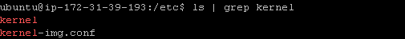
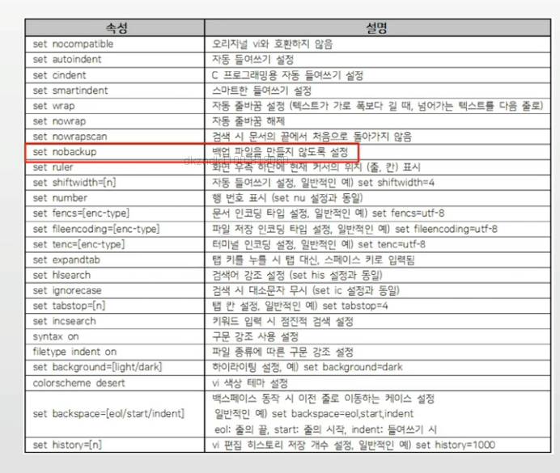

## 목차
1. [Linux 배경지식](#linux-배경지식)
2. [클라우드 컴퓨팅과 AWS, 리눅스](#클라우드-컴퓨팅과-aws-그리고-리눅스)
3. [리눅스 파일시스템](#리눅스-파일-시스템)
4. [리다이렉션과 파이프](#리다이렉션과-파이프)
5. [프로세스 관리](#프로세스-관리)
6. [리눅스 쉘](#리눅스-쉘)
7. [VI 에디터](#vi-에디터)
8. [쉘 스크립트](#쉘-스크립트)

## Linux 배경지식

### 한번은 알아둬야 할 리눅스 배경, 역사, 철학

> 참고이지만 한번은 알아두면 좋을 배경지식
- 소프트웨어 역사
- 배경과 철학을 이해할 필요가 있음
    - 최신 IT 업계 방향 이해 가능.

### 리눅스 시작
- 리누스 토발즈(Linus Torvalds)가 개발
    - 대학에 있는 UNIX 컴퓨타를 집에서 쓰고 싶다.
    - 다중 사용자, 다중 작업(시분할 시스템, 멀티 태스킹)을 지원하는 유닉스(UNIX)와 유사한 운영체제

### GNU 프로젝트
- GNU = Gnu is Not Unix
- 유닉스 운영체제를 여러 회사에서 각자 개발, 소스를 공유하지 않는 문화에 반발
- 리차드 스톨만 : 초기 컴퓨터 개발 공동체의 상호협력적인 문화로 돌아갈 것을 주장하며, 1985년도에 GNU 선언문을 발표
- GNU 프로젝트를 지원하기 위해 자유 소프트웨어 재단(FSF) 설립과, GNU 공개 라이선스(GPL)라는 규약을 제공

### GPL 라이선스와 GNU 프로젝트
- GPL 프로그램은 어떤 목적으로, 어떤 형태로든 사용할 수 있지만,
- 사용하거나 변경된 프로그램을 다시 배포하는 경우, 동일한 GPL 라이선스로 공개를 해야 함
- 소스 오픈을 장려하기 위함

> 그래서 소스까지 오픈된 유명한 프로그램이 많음 (예: apache)

### GNU 프로젝트와 GNU Hurd
- 운영체제 커널 개발 시도 - GNU Hurd
- 운영체제에 필요한 라이브러리 ,컴파일러, 에디터, 쉘 개발

> 참고 : GNU hurd

### GNU 프로젝트와 리눅스
- GNU Hurd 개발 지연
- 리누스 토발즈가 리눅스 커널 소스 오픈
- GNU 프로젝트 산출물과 리눅스 커널이 통합 개발

> OS 지식을 기반으로 보다 깊이 이해
>
> 커널, 쉘, 라이브러리, 응용 프로그램과 GNU 프로젝트

### GNU/리눅스 world
- GNU 프로젝트 기여가 크므로, GNU/Linux 라고 부르기를 희망
    - 리차드 스톨만 (GNU 프로젝트 창시자)의 희망
    - 그래도 리눅스 세계에서 프로그램 설정, 다운로드 등등 여러 과정들에서 가끔 GNU, GPL등 용어를 볼 수 있음

- 수많은 개발자가 수시로 각 프로그램 개발에 기여하고, 만들어진 프로그램을 활용
    - 따라서 수시로 명령이 바뀌거나, 버그가 있을 수도 있고, 가이드가 부실할 수도 있음
    - 이런 환경에서, 바뀐 명령을 구글링으로 찾고, 사용법을 스스로 알아내고, 버그도 스스로 해결하는 방법을 찾음
    - 모든 것을 스스로 할 수 있는 좋은 개발자만 깊게 활용 가능

## 클라우드 컴퓨팅과 AWS, 그리고 리눅스
- 서버 기술 기초 요약 - 리눅스 이해
    - 리눅스 사용법을 익히기 위해, 리눅스 환경 구축이 필요함
    - 개인 PC에 리눅스 환경을 구축할 경우, 각 PC 환경에 따라, 다양한 케이스가 발생할 수 있음
    - 따라서, 동일한 환경을 구축할 겸, 클라우드 컴퓨팅과 AWS에도 익숙해질 겸, AWS에 리눅스 서버를 구축하고, 이를 기반으로 리눅스 사용법을 익히기로 함

> 최근 개발자 기본 역량은 클라우드 컴퓨팅(AWS 추천) + 리눅스(+ 도커 추천) + 자기 분야 프로그래밍

### 가볍게 이해하는 클라우드 컴퓨팅
- 리눅스 설치 방법
    - 가상 머신 소프트웨어
        - PC 환경에 따라서, 예상치 못한 문제들을 만날 수 있음
    - 클라우드 컴퓨팅 서비스 활용
        - 최신 기술에 익숙해진다는 장점
        - 동일한 환경에서 사용이 가능


- 클라우드 컴퓨팅 서비스 : 서버 환경을 미리 구축해놓고, 간단한 설정으로 바로 사용할 수 있도록 만든 서비스

- 이전 : 미리 서버 컴퓨터를 구축
- 현재 : 클라우드 컴퓨팅 환경 사용

### 클라우드 컴퓨팅 설정
- Amazon Web Service (AWS)
    - https://aws.amazon.com/ko/free/
    - 무료로 1년간 사용 가능
        - 리눅스 사용 후 계정을 닫으면 됨.

### 클라우드 컴퓨팅 설정 - 리눅스 설치
1. EC2(서버) 생성 (우분투 리눅스 OS 기반)
2. Elastic IP (탄력적 IP, 고정 IP) 생성
3. 자기 PC에서 EC2(서버) 접속 - 맥, 윈도우

### Elastic IP
- AWS EC2 서비스를 생성하게 되면 IP를 랜덤하게 배정 받는다.
- AWS의 서비스 상황에 따라 부여받은 IP 주소가 달라질 위험성이 있다.
- 그래서 Elastic IP를 부여받고 해당 IP를 이용하여 사용할 서버에 고정적인 IP 주소를 부여받는다.

### PUTTY
- 클라우드에 접근할 때 보안 설정을 지원함

### 보안 키 생성
1. AWS에서 KeyPair 생성
2. puttygen.exe 에서 Save Private Key 생성
    - Conversion => import key
    - AWS KeyPair 선택 
    - save private key


### 참고 : UNIX 계열 시스템에서의 파일 권한
- 사용자
    - 소유자 : 소유자에 대한 권한
    - 그룹 : 소유자가 속해 있는 그룹에 대한 권한
    - 공개 : 모든 사용자들에 대한 권한
- 퍼미션 종류, (권한 기호)
    - 읽기(r) : 읽기 권한, 쓰기(w) : 쓰기 권한, 실행(x) : 실행 권한

> OS 지식을 기반으로 보다 깊게 이해해보기!
>
> inode 파일 시스템과 사용자별 퍼미션 

### chmod - 파일 권한 변경
- 숫자를 사용하는 방법


### 맥에서 접속하기
- 다운로드 받은 프라이빗 키의 권한 설정
    - 터미널 오픈 후, 권한 변경

```cmd
chmod 400 awstestdavelee.pem
ssh -i <AWS KEY Pair> ubuntu@<IP Address>
ex ) ssh -i awstestdavelee.pem ubuntu@13.209.45.243
```

## 리눅스 파일 시스템

### 리눅스와 파일
- 모든것은 파일이라는 철학을 따름
    - 모든 인터렉션은 파일을 읽고, 쓰는 것처럼 이루어져 있음.
    - 마우스, 키보드와 같은 모든 디바이스 관련된 기술도 파일과 같이 다루어짐

- 파일 네임스페이스
    - A 드라이브(A:/), C드라이브(C:/windows) (X)
    - 전역 네임스페이스 사용
        - /media/floofy/dave.jpg

### 쉘 종류
- 쉘(shell) : 사용자와 컴퓨터 하드웨어 또는 운영체제간 인터페이스
    - 사용자의 명령을 해석해서, 커널에 명령을 요청해주는 역할
    - 관련된 시스템콜을 사용해서 프로그래밍이 작성되어 있다.

> OS 지식을 보다 깊게 이해해보기
>
> 쉘 사용법과 프로세스

- Bourne-Again Shell (bash) : GNU 프로젝트의 일환으로 개발됨, 리눅스 거의 디폴트임
- Bourne Shell (sh)
- C Shell (csh)
- Korn Shell (ksh) : 유닉스에서 가장 많이 사용됨.

### 리눅스 기본 명령어 정리
- 리눅스 명령어는 결국 쉘이 제공하는 명령어
- 리눅스 기본 쉘이 bash 이므로, bash에서 제공하는 기본 명령어를 배우는 것

### whoami : 로그인한 사용자 ID를 알려줌
```
# whoami
root
```
- root : 슈퍼관리자 ID


### sudo 명령어 : root 권한으로 실행하기
- root 계정으로 로그인 하지 않은 상태에서 root 권한이 필요한 명령을 실행할 수 있도록 하는 프로그램
- 기본 사용법
    - sudo 명령어
    - 사용 예
         - suodo apt-get update
- 예 : sudo apt-get update

### pwd : 현재 디렉토리 위치
```
# pwd
/
```

### cd : 디렉토리 이동
```
# pwd = > 현재 디렉토리 위치 알려줌.
/etc

# cd ~ => home 폴더로 이동
# pwd
/home

# cd ~
# pwd
/home
```

### ls : 파일 목록 출력


### 리눅스와 권한
- 운영체제는 사용자/리소스 권한을 관리
- 리눅스는 사용자/그룹으로 권한을 관리
- root는 슈퍼관리자
- 파일마다 소유자, 소유자 그룹, 모든 사용자에 대해
    - 읽고, 쓰고, 실행하는 권한을 관리

### ls와 파일 권한


### 파일 권한
- 사용자
    - 소유자 소유자에 대한 권한
    - 그룹 소유자가 속해 있는 그룹에 대한 권한
    - 공개 모든 사용자들에 대한 권한
- 퍼미션 종류, (권한 기호)
    - 읽기(r) : 읽기 권한
    - 쓰기(w) : 쓰기 권한
    - 실행(x) : 실행 권한

### chmod : 파일 권한 변경
- 숫자를 사용하는 방법


- 주로 사용하는 옵션
    - chmod -R 777 directory


### cat : 파일 보기


```
# cat mysql.cnf
mysql.cnf 파일 내용이 출력됨.
```

### rm : 파일 및 폴더 삭제
- 주로 사용하는 명령어 형태 : rm -rf 디렉토리명
- r 옵션 : 하위 디렉토리를 포함한 모든 파일 삭제
- f 옵션 : 강제로 파일이나 디렉토리 삭제
```
# rm mysql.cnf
```

> 기본적으로는 리눅스에는 휴지통이 없기 때문에, root와 같은 슈퍼관리자로는 작업하지 않음.


## 리다이렉션과 파이프

### Standard Stream (표준 입출력)
- command로 실행되는 프로세스는 세 가지 스트림을 가지고 있음
    - 표준 입력 스트림 (Standard Input Stream) - stdin
    - 표준 출력 스트림 (Standard Output Stream) - stdout
    - 오류 출력 스트림 (Standard Error Stream) - stderr
- 일반적으로 표준 출력 및 오류 출력 스트림은 plain text로 console에 출력하도록 되어 있음

> OS 지식을 기반으로 보다 깊게 이해해보기!
>
> 프로세스, fork 그리고 스트림

### 리다이렉션(redirection)
- 표준 스트림 흐름을 바꿔줄 수 있다.
    - >, < 을 사용함
    - 주로 명령어 표준 출력을 화면이 아닌 파일에 쓸 때


> 명령어에 대한 표준 출력을 화면에다가 나타내는 것이 아닌 파일에다가 덧씌워서 생성한다.

- 예
    - i. ls > files.txt
        - ls로 출력되는 표준 출력스트림의 방향을 files.txt로 바꿔줌 (files.txt에 ls로 출력되는 결과가 저장됨)
    - ii. head < files. txt
        - files.txt의 파일 내용이 head 라는 파일의 처음부터 10 라인까지 출력해주는 명령으로 넣어짐 (files.txt 의 앞 10 라인이 출력됨)

- 기존 파일에 추가는 >> 또는 << 사용
    - ls >> files.txt
    - 기존에 있는 files.txt 파일 끝에, ls 출력 결과를 추가해줌

### 파이프 (pipe)
- 두 프로세스 사이에서 한 프로세스의 출력 스트림을 또다른 프로세스의 입력 스트림으로 사용할 때 사용됨.


### 파이프 예시
- ls | grep files.txt
    - ls 명령을 통한 출력 내용이 grep 명령의 입력 스트림으로 들어감
    - grep files.txt 는 grep 명령의 입력 스트림을 검색해서 files.txt 가 들어 있는 입력 내용만 출력 해줌
    - 따라서, ls 명령으로 해당 디렉토리 / 파일 중에 files.txt 파일이 있는지를 출력해 줌.



### 참고 : grep 명령어
- grep : 검색 명령
    - grep [-option][pattern][file or directory]

```terminal
<option>
    - i : 영문의 대소문자를 구별하지 않는다.
    - v : pattern을 포함하지 않는 라인을 출력한다.
    - n : 검색 결과의 각 행의 선두에 행 번호를 넣는다 (first line is 1).
    - l : 파일명만 출력한다.
    - c : 패턴과 일치하는 라인의 개수만 출력한다.
    - r : 하위 디렉토리까지 검색한다.
```

## 프로세스 관리

### 프로세스 vs 바이너리
- 코드 이미지 또는 바이너리 : 실행파일
- 실행 중인 프로그램 : 프로세스
    - 가상 메모리 및 물리 메모리 정보
    - 시스템 리소스 관련 정보
    - 스케쥴링 단위

### 리눅스는 다양한 프로세스 실행 환경
- 리눅스는 기본적으로 다양한 프로세스가 실행됨
    - 유닉스 철학 : 여러 프로그램이 서로 유기적으로 각자의 일을 수행하면서 전체 시스템이 동작하도록 하는 모델

### foreground process / background process
- foreground process : 쉘(shell)에서 해당 프로세스 실행을 명령한 후, 해당 프로세스 수행 종료까지 사용자가 다른 입력을 하지 못하는 프로세스

- background process : 사용자 입력과 상관없이 실행되는 프로세스
    - 쉘(shell)에서 해당 프로세스 실행시 ,맨 뒤에 &를 붙여줌
    - 사용 예

```
# find / -name '*.py' > list.txt &
[1] 57
```


> 작업 중간에 ls -al 명령어를 치면 작업이 우선적으로 수행 된다.
>
> 즉 & 기호를 끝에 붙이면 해당 작업은 백그라운드 프로세스로 취급 되며 수행 중인 작업이 없다면 실행 되고 수행중인 작업이 있다면 작업 번호가 붙여진 채로 프로세스 대기 목록에 생성된다.

> [1]은 작업번호(job number), 57은 pid(process ID)를 나타냄

### foreground process 제어하기
- [CTRL] + c : 프로세스 작업 취소 (해당 프로세스는 완전히 종료됩니다.)

> OS 지식을 기반으로 보다 깊게 이해해보기!
>
> foreground / background process와 쉘, Ctrl + c

- jobs 
```
현재 background process 목록을 보여준다.
```

### 프로세스 상태 확인 - ps 명령어
- 사용법 : ps [option(s)]
- option(s)
```
- a : 시스템을 사용하는 모든 사용자의 프로세스 출력
    (보통 aux 와 같이 u, x 옵션과 함께 사용)
- u : 프로세스 소유자에 대한 상세 정보 출력
- l : 프로세스 관련 상세 정보 출력
- x : 터미널에 로그인한 후 실행한 프로세스가 아닌 프로세스들도 출력함.
      주로 데몬 프로세스(daemon process) 까지 확인하기 위해 사용.
      본래 ps 명령은 현재 쉘(shell)에서 실행한 프로세스들만 보여주기 때문에 이 옵션을 사용하는 경우가 많음.
- e : 해당 프로세스와 관련된 환경 변수 정보도 함께 출력
- f : 프로세스 간 관계 정보도 출력
```

- 데몬 프로세스(daemon process) : daemon은 악마를 의미함. 사용자 모르게 시스템 관리를 위해 실행되는 프로세스로 보통 시스템이 부팅될 때 자동 실행 (예: ftpd, inetd 등)
- 보통 ps aux 를 많이 사용

### 프로세스 상태 확인 - ps 명령어(2)
- 주요 ps 출력 정보 항목(ps -aux)
```
USER : 프로세스를 실행시킨 사용자 ID
PID : 프로세스 ID
%CPU : 마지막 1분 동안 프로세스가 사용한 CPU시간 백분율
%MEM : 마지막 1준 동안 프로세스가 사용한 메모리 백분율
VSZ : 프로세스가 사용하는 가상 메모리 크기
RSS : 프로세스에서 사용하는 실제 메모리 크기
STAT : 프로세스 상태
START : 프로세스가 시작된 시간
TIME : 현재까지 사용된 CPU 시간(분1초)
COMMAND : 명령어
```


> 운영체제를 익힌 후라야, 실무 기술도 자연스럽게 각 부분이 이해가 됨.

### man ps : ps 명령와 관련된 메뉴얼 확인 가능
```
man ps
/STATE => 찾고자 하는 문자열
ENTER => 엔터를 한번 쳐준다.
n => 그 다음 찾고자하는 문자열이 있는 텍스트로 넘어감.
```


### 프로세스 중지시키기
- kill 명령어
    - 사용법
        - a. kill % 작업 번호(job number)
        - b. kill 프로세스 ID(pid)
        - c. 작업 강제 종료 옵션 - 9
            - 예
```
find / -name '*.py' > list.txt &
[1] 57
# kill -9 57
```

### 현업에서 주로 사용하는 실무 프로세스 명령
> 적어도 이 명령은 편하게 사용해야 함
- ps aux | grep 프로세스 명 : 프로세스가 실행 중인지를 확인하고, 관련 프로세스에 대한 정보 출력
- kill -9 프로세스 ID(pid) : 해당 프로세스를 강제로 죽임
- 명령 & : 터미널에서 다른 작업을 해야하거나, 프로세스 실행에 오랜 시간이 걸릴 경우 background로 실행
- [CTRL] + c : 프로세스 종료(실행 취소)

## 리눅스 쉘

### 하드 링크와 소프트 링크
- cp 명령: 파일 복사
    - 1MB 사이즈를 가지고 있는 A 파일을 B 파일로 복사
        - cp A B -> A와 B는 각각 물리적으로 10 MB 파일로 저장
    - 하위 폴더 포함 복사하기

```
cp -rf * 폴더
```

- 하드 링크: In A B
    - A와 B는 동일한 10MB 파일을 가리킴
        - A 파일의 내용을 변경하면 B파일의 내용도 변경됨.
        - A 파일을 삭제해도 B 파일에 해당 파일의 내용이 존재함.
    - 즉, 동일한 파일을 가진 이름을 하나 더 만든 것일 뿐
        - 전체 파일 용량은 달라지지 않음


### 참고 : 운영체제 디렉토리 엔트리
- 리눅스 파일 탐색 : 예 - /home/ubuntu/link.txt
    - i. 각 디렉토리 엔트리(dentry)를 탐색
        - 각 엔트리는 해당 디렉토리 파일/디렉토리 정보를 가지고 있음.
    - ii. '/' dentry에서 'home'을 찾고, 'home'에서 'ubuntu'를 찾고, 'ubuntu'에서 link.txt 파일이름에 해당하는 inode를 얻음


### 참고 : 하드 /소프트 링크와 inode


### 하드 링크와 소프트 링크
- 소프트(심볼릭) 링크: ln -s A B
    - Windows OS의 바로가기와 동일
    - ls -al 하면, 소프트 링크 확인 가능
```
lrwxr-xr-x link3.txt => link2.txt
```
- rm A로 A를 삭제하면? B는 해당 파일 접근 불가


### ubuntu 배포판
- 다양한 배포판 중 하나
- 데비안 배포판을 기반으로 캐노니컬 사가 우분투 배포판 개발
    - 데비안 배포판은 apt 프로그램을 이용해서 소프트웨어 설치 및 업데이트를 간편하게 한 패키지
- 우분투 의미 : 남아프리카 부족 언어로 '너가 있으니 나도 있다'라는 의미
    - 우분투 데스크탑 배포판 (X 윈도우 기반, GUI환경 기본 제공) 과 우분투 서버 배포판, 두가지 기본 배포판을 제공
    - 지원 기간이 짧은 일반 버전과 지원기간이 장기(5년)인 LTS(Long Term Support)버전으로 나눠서 발표

- CentOS나 Fedora과 같은 RedHat 계열 배포판은 RPM 이라는 패키징 시스템을 사용함
- ubuntu와 같이 데비안 계열 배포판은 deb라는 패키징 시스템을 사용함
- 패키지와 패키지 정보를 저장하고 있는 패키지 저장소라는 개념을 가지고 있음
- 소프트웨어 패치, 추가 등 정보를 관리
- 우분투 사용자가 패키지 관리자를 통해 패키지 저장소에 접근하면, 소프트웨어 변경사항을 알려주고 업데이트, 다운로드등을 지원

### ubuntu 패키지 관리 실무
- ubuntu 패키지 인덱스 정보 업데이트 (배포판 버전에 따른 패키지 업데이트 버전 정보 등)
```
# sudo apt-get update
```


- 설치된 ubuntu 패키지 업그레이드(함부로 하지 않을 것)
```
# sudo apt-get upgrade
```

- 패키지 설치
```
# sudo apt-get install 패키지명
```

- 패키지 삭제(설정파일 제외)
```
# sudo apt-get remove 패키지명
```

- 패키지 삭제(설정파일 포함)
```
# sudo apt-get --purge remove 패키지명
```

### 현업과 리눅스 운영
- 패키지는 설치 후, 삭제해도 정상 삭제가 안되는 경우가 많음
    - 설정 파일, 남겨진 파일들을 일일이 삭제해줘야 하는 경우도 많음
- 함부로 프로그램 업데이트 시, 다른 프로그램과 함께 동작하는 부분이 테스트된 적이 없어서, 정상동작안할 수 있음(업데이트는 신중하게 함)
- 가능한 남들이 가장 많이 쓰는 프로그램 버전과 조합을 사용함
    - 그래야 이슈가 생겨도 구글링을 통해 해결이 가능함
- 구글링은 필수!

## VI 에디터

### VIM 에디터 이해 및 설치
- VIM : Vi improved 에서 앞 글자를 빼내어 만든 이름
    - Vi : 전통적인 유닉스 에디터(개발자: 빌 조이), Visual Editor의 줄임말
    - Vim은 Vi에 자동화, 시각화 메뉴등을 추가한 프로그램
    - Vim 이외에 이맥스(Emacs, GNU 프로젝트 설립자 리차드 스톨만이 개발) 라는 유명한 에디터가 있음 (대부분 개발자는 두 에디터 중 하나를 사용함)

- 설치
    - 리눅스 : sudo apt-get install vim
    - 최근에는 패키지에 기본적으로 추가 됨.

### VIM 네 가지 모드
- 일반(명령) 모드 : 처음 vim을 실행했을 때 또는 입력 모드/ 명령 모드에서 ESC 입력 시 - 찾기, 커서 이동 등
- 명령(명령행) 모드 : 일반 모드에서 : 입력 시 - 저장, 파일읽기, vim 설정 등
- 입력(편집) 모드 : 일반 모드에서 a 또는 i 또는 o 키 입력 시 - 내용 입력
- Visual 모드 : 일반 모드에서 v 입력 시 - 블럭 복사/붙이기

### vim 간단한 사용법

- 입력
```
i 포커스 잡힌 커서 위치에서 편집모드 시작
a 포커스 잡힌 커서 위치 바로 다음에서 편집모드 시작
```

- 삭제(일반 모드에서 실행해야 함)
```
x 커서의 한 문자를 삭제
```

- 파일 저장
```
:w 현재 오픈된 파일 저장
:q 저장하지 않고 종료(quit)
:wq 현재 오픈된 파일 저장 후 종료
:q! 강제 종료(대소문자 구분)
```

- 블록 저장 및 복사 (Visual 모드에서 활용)
```
V 단어 단위로 블럭 지정
Shift + v 라인 단위로 블럭 지정.
y 지정된 블럭을 복사
p 복사된 블럭을 현재 커서에 붙인다.
u 직전 실행 작업 취소

자주 사용하는 시나리오
1. v 로 visual 모드로 들어간 후
2. Shift 를 누른 채 커서 이동을 통해 블록 지정
3. y를 눌러 블록 복사
4. 붙이기 필요한 곳으로 커서 이동 후 p를 눌러 복사된 블록 붙이기
```

- 편집
```
x 커서의 한 문자를 삭제한다.
dd 커서의 현재 라인을 삭제한다.
Shift + j 커서의 아래 라인과 현재 라인을 하나의 라인으로 합침
```

- 명령(명령행) 모드에서 set all 입력(결국: set all 입력 후 엔터)
    - vim에서 설정할 수 있는 모든 옵션이 나옴
- ~/.vimrc 파일에 필요한 vim 설정을 할 수 있음.

### vim 주요 설정



## 쉘 스크립트

### 쉘 스크립트
- 쉘을 사용해서 프로그래밍을 할 수 있음
- 서버 작업 자동화 및 운영(DevOps)을 위해 기본적으로는 익혀둘 필요가 있음
- 쉘 명령어를 기본으로 하되, 몇 가지 문법이 추가된 형태
- 시스템 프로그래밍에서 꼭 익히는 내용 중 하나

### 쉘 스크립트 예

- 문제점
```
서버가 어느날 다운
확인해보니 서버 저장공간이 하나도 남지 않음
로그 파일 업데이트가 안되어 관련 프로그램 비정상 종료
이유는 로그 파일이 많이 쌓여있음
어떻게 하면 자동으로 오래된 로그 파일을 삭제?
```

- 해결
> 간단한 쉘 스크립트 생성 및 주기적 실행

### 기본 문법
- 쉘 스크립트는 파일로 작성 후, 파일을 실행
- 파일의 가장 위의 첫 라인은 "#!/bin/bash"로 시작
- 쉘 스크립트 파일은 실행 권한을 가지고 있어야 함
- 일반적으로 `파일이름.sh`와 같은 형태로 파일 이름을 작성.

### test.sh
```
# cd ~
# vi test.sh
```

- echo는 화면에 출력해주는 쉘 명령어
```
#!/bin/bash

echo "Hello bash"
```

> 여러 쉘 명령어를 조합해서 프로그래밍

```
# ls -al
drwx------ 1 root root 4096 Oct 8 15:27 .
drwxr-xr-x 1 root root 4096 Oct 8 07:35 ..
-rw-r--r-- 1 root root   32 Oct 8 15:27 test.sh


# chmod +x test.sh
# ./test.sh
Hello bash
#
```

### 주석
```
# 기호로 시작하는 라인은 주석 처리
# This is comment
```

### 변수
- 선언
    - 변수명 = 데이터
    - 변수명 = 데이터 사이에 띄어쓰기는 허용되지 않음
- 사용
    - $변수명으로 사용됨

```
예)
#!/bin/bash

mysql_id='root'
mysql_directory='/etc/mysql'

echo $mysql_id
echo $mysql_directory
```

### 리스트 변수(배열)
- 선언
    - 변수명 = (데이터1 데이터2 데이터 3...)
- 사용
    - $(변수명[인덱스번호])

```
#!/bin/bash

daemons=("httpd","mysqld" "vsftpd")
echo ${daemons[1]} # $daemons 배열의 두번째 인덱스에 해당하는 mysqld 출력
echo ${daemons[0]} # $daemons 배열의 모든 데이터 출력
echo ${daemons[*]} # $daemons 배열의 모든 데이터 출력
echo ${#daemons[0]} # $daemons 배열 크기 출력

filelist = {${ls}} # 쉘 스크립트 실행 디렉토리의 파일 리스트를 배열로 $filelist 변수에 입력
echo ${filelist[*]} # $filelist 모든 데이터 출력
```

### 사전에 정의된 변수
```
$$ : 쉘의 프로세스 번호
$0 : 쉘스크립트 이름
$1 ~ $9 : 명령줄 인수
$* : 모든 명령줄 인수리스트
$# : 인수의 개수
$7 : 최근 실행한 명령어의 종료 값
    - 0 (성공), 1 ~ 125 (에러),
    - 126 (파일이 실행가능하지 않음),
    - 128 ~ 255 (시그널 발생)
```

### 연산자
- expr : 숫자 계산
- expr를 사용하는 경우 역작은 따옴표(`)를 사용해야 함(작은 따옴표가 아님)
- 연산자 *와 괄호() 앞에는 역슬래시()와 같이 사용
- 연산자와 숫자, 변수, 기호 사이에는 space를 넣어야 함!
```
예)
num=`expr \(3 \*5 \) / 4 + 7`
echo $num
```

### 조건문 문법
- 기본 if 구문
    - 명령문을 꼭 탭으로 띄워야 하는 것은 아님(then과 fi 안에만 들어가 있으면 됨)
```
if [ 조건 ]
then
    명령문
else
    명령문
fi
```

> python이 얼마나 가독성이 좋은지 이해할 수 있음

### 조건
- 조건 작성이 다른 프로그래밍 언어와 달리 가독성이 현저히 떨어짐. 필요할 때마다 참조하면 됨!

- 문자 비교
```
문자1 == 문자 2 # 문자 1과 문자 2가 일치
문자1 != 문자 2 # 문자1과 문자2가 일치하지 않음
-z 문자 # 문자가 null 이면 참
-n 문자 # 문자가 null 이 아니면 참
```

- 수치 비교 (<, > 는 if 조건시 [[]]를 넣는 경우 정상 동작하기도 하지만, 기본적으로 다음 문법을 사용하는 것을 권장 )

```
값1 ~eq 값2 # 값이 같음(equal)
값1 ~ne 값2 # 값이 같지 않음(not equal)
값1 ~lt 값2 # 값1이 값 2보다 작음(less than)
값1 ~le 값2 # 값1이 값 2보다 작거나 같음(less or equal)
값1 ~gt 값2 # 값1이 값2보다 큼(greater than)
값1 ~ge 값2 # 값1이 값2보다 크거나 같음(greater or equal)
```

- 파일 검사
```
-e 파일명 # 파일이 존재하면 참
-d 파일명 # 파일이 디렉토리면 참
-h 파일명 # 심볼릭 링크파일
-f 파일명 # 파일이 일반파일이면 참
-r 파일명 # 파일이 읽기가능이면 참
-s 파일명 # 파일 크기가 0이 아니면 참
-u 파일명 # 파일이 set-user-id가 설정되면 참
-w 파일명 # 파일이 쓰기 가능 상태이면 참
-x 파일명 # 파일이 실행 가능 상태이면 참
```

- 논리 연산(참고)
```
조건1 -a 조건2 # AND
조건1 -o 조건2 # OR
조건1 && 조건2 # 양쪽 다 성립
조건1 || 조건2 # 한쪽 또는 양쪽다 성립
!조건 # 조건이 성립하지 않음
true # 조건이 언제나 성립
false # 조건이 언제나 성립하지 않음
```

- 쉘 스크립트 해석하기
```
#!/bin/bash
ping -c 192.168.0.1 1> /dev/null

if [ $? == 0 ]
then
    echo "게이트웨이 핑 성공!"
else
    echo "게이트웨이 핑 실패!"
fi
```

### 조건문 한줄에 작성하기
- if 구문 (한 라인에 작성하는 방법)
```
if [ 조건 ]; then 명령문; fi

예)
if [ -z $1 ]; then echo "Insert arguments"; fi
```
- if [ 뒤와, ] 앞에는 반드시 공백이 있어야 함.
- [ ] 에서 &&, ||, <, > 연산자들이 에러가 나는 경우는 [[]]를 사용하면 정상 작동하는 경우가 있음.

### 반복문 문법
- 기본 for 구문
```
for 변수 in 변수값1 변수값 2 ...
do
    명령문
done
```

### 쉘 스크립트 해석
- 현재 디렉토리에 있는 파일과 디렉토리를 출력하라
```sh
#!/bin/bash
for database in $(ls)
do
    echo $database
done

#!/bin/bash
for database in $(ls); do
    echo $database
done

#!/bin/bash

for database in $(ls); do echo $database; done
```

- 현재 디렉토리에 있는 파일과 디렉토리를 출력하라
```sh
#!/bin/bash
lists=$(ls)
num=${#lists[@]}
index = 0
while [ $num -ge 0]
do
    echo ${lists[$index]}
    index=`expr $index + 1`
    num=`expr $num - 1`
done
```

### 참고: 압축 명렁 tar
- 리눅스에서는 여러 파일을 한 파일로 묶은 것을 아카이브(archive)라고 함
    - 파일 확장자는 .tar
- 리눅스에서 파일 압축은 두 단계로 진행
    1. 아카이브(archive)로 만듬
    2. gzip 프로그램을 사용해서 압축함 + 파일 확장자는 .tar.gz
- 압축 명렁은 tar를 사용하되, 옵션을 사용해서 gzip 기능을 사용함.

- 주요 옵션
```
x : 묶음을 해제
c : 파일을 묶음
v : 묶음/해제 과정을 화면에 표시
z : gunzip을 사용
f : 파일 이름을 지정
```

- 압축시 주로 사용하는 옵션
```sh
tar -cvzf [압축된 파일 이름] [압축할 파일이나 폴더명]
```

- 압축을 풀을 때 주로 사용하는 옵션
```sh
tar -svzf [압축 해제할 압축 아카이브 이름]
```

### 쉘 스크립트
- 백업하기
```sh
#!/bin/bash

if [ -z $1 ] || [ -z $2 ]; then
    echo usage: $0 sourcedir targetdir
else
    SPCDIR=$1
    DSTDIR=$2
    BACKUPFILE=backup.$(date + %y%m%d%H%M%S).tar.gz
    if [ -d $DSTDIR ]; then
        tar -cvzf $DSTDIR/$BACKUPFILE $SRCDIR
    else
        mkdir $DSTDIR
        tar -cvzf $DSTDIR/$BACKUPFILE $SRCDIR
    fi
fi
```

### 쉘 스크립트 
- 로그 파일 정리하기
```
find . -type f -name '파일명검색어' -exec bash -c "명령어1; 명령어2; 명령어3;" \;
# -type f: 파일 타입 지정해서 검색(f는 일반 파일)
```

```sh
#!/bin/bash
LOGDIR=/var/log
GZIPDAY=1
DELDAY=2
cd $LOGDIR
echo "cd $LOGDIR"

sudo find . -type -f -name '*log.?' -mtime + $GZIPDAY - exec -bash -c "gzip {}" \; 2> /dev/null

sudo find . -type -f -name '*.gz' -mtime + $DELDAY - exec -bash -c "rm -f {}" \; 2> /dev/null
```