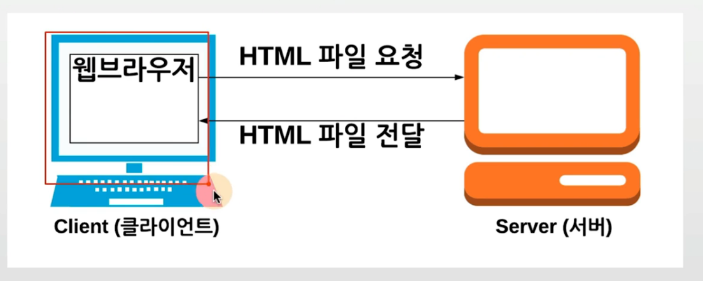

## 시스템 프로그래밍과 서버 기술
- 시스템 프로그래밍 과정은 명확한 커리큘럼이 있는 것은 아님
- 가장 일반적인 과정은 UNIX(리눅스) 기본 사용법을 익히며, OS와 실무 기술을 익히는 과정임
- 이외에 추가해서 C언어 기반 UNIX 상에서의 C 프로그래밍 기술에 대해 익히기도 함
- 이 중에서 최신 현업에서는 어느 개발자나 꼭 필요한 리눅스 (UNIX 계열) 사용법을 익히기로 함
- 여기에 추가해서, 클라우드 컴퓨팅(AWS)을 사용해서, 서버 컴퓨터를 구축하는 기법까지 익히기로 함

> 최신 현업 기술에 맞추어, 꼭 필요한 기술과 배경지식으로 구성.

### 리눅스(Linux)
- 서버에 많이 사용되는 운영체제
    - 클라이언트와 서버를 혹시 모르시는 분들을 위해서

- 최근 서버 환경은 주로 리눅스
- 프로그래밍을 할 때에도 많이 사용이 됩니다.
- 임베디드 시스템등에서도 많이 사용됨
    - 대표적인 예가 안드로이드임
- 클라우드 컴퓨팅 (AWS), 도커 등의 서버 기본 기술과도 함께 더욱 많이 사용됨
    - AWS : https://aws.amazon.com/

