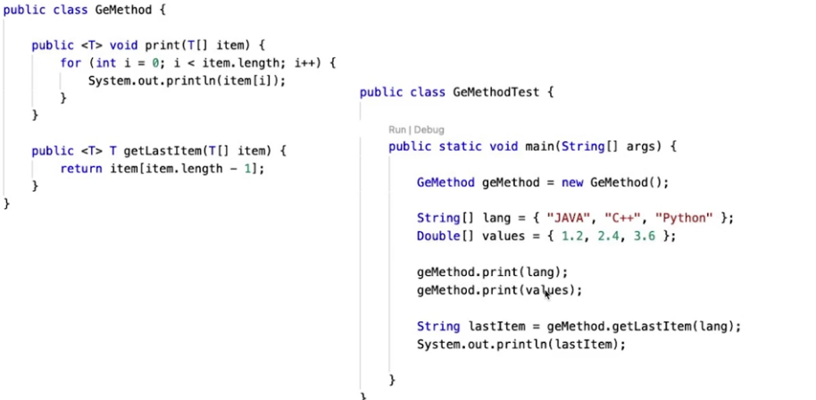

## 제네릭 클래스
- 일반적이라는 의미로 하나의 코드로 여러 타입 동시 처리 기술
- 다양한 종류의 데이터를 처리할 수 있는 클래스와 메소드를 작성하는 기법
- JDK 1.5부터 사용
- 클래스를 정의할 때 클래스 안에서 사용하는 자료형을 구체적으로 명시하지 않고 T와 같은 기호로 표시
- 이후 객체를 생성할 때 T 자리에 구체적인 자료형을 적어줌.

### 타입 변수 표기법
- 제네릭 클래스는 여러 개의 타입 매개 변수를 가질 수 있으나 타입의 이름은 클래스나 인터페이스 내에서 유일해야 함.
- 한개의 대문자로 표시하는게 관례(변수의 이름과 구분하기 위해서)
- 타입 매개 변수는 기초 자료형으로 객체화될 수 없음

- E : Element(요소: 자바 컬렉션 라이브러리에서 많이 사용)
- K - Key
- N - Number
- T - Type
- V - Value
- S, U, V 등

### 제네릭 메소드
- 일반 클래스의 메소드에서도 타입 매개 변수를 사용하여 제네릭 메소드를 정의,
이때 타입 매개 변수의 범위는 메소드 내부로 제한됨.

